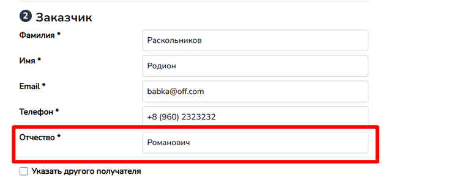
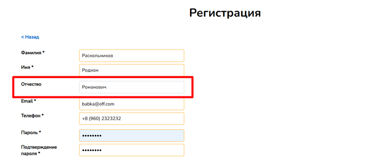
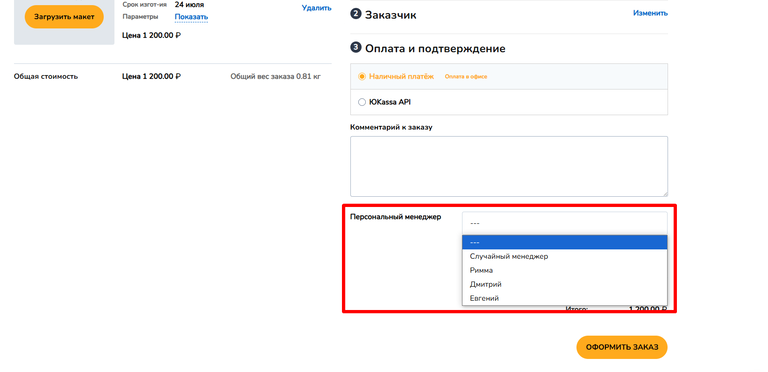
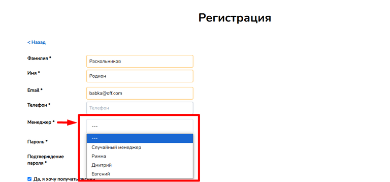
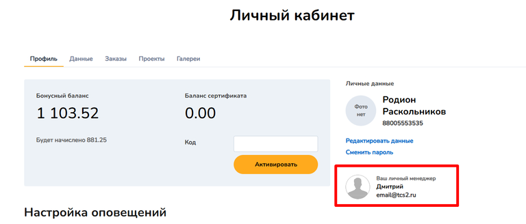
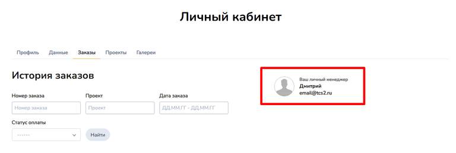
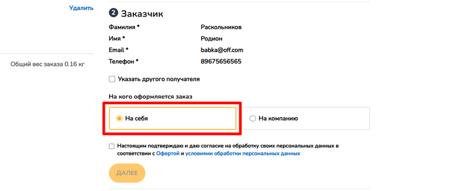
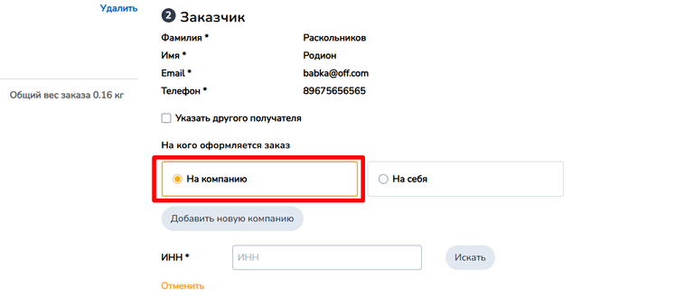
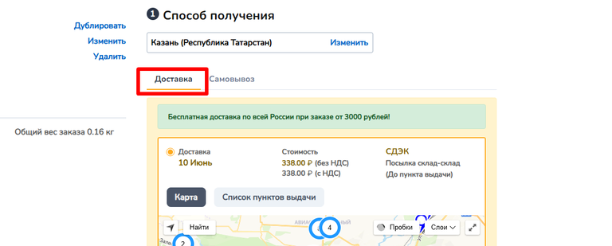
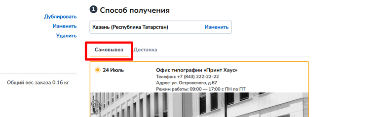

# Настройки оформления заказа

### **Обязательная загрузка макета в калькуляции**

<figure>

.png>)

<figcaption>

</figcaption>

</figure>

При активации этой опции для всех товаров по умолчанию потребуется загрузить макет перед добавлением в корзину. Это необходимо типографиям, которые не принимают заказы без макетов.

**Исключение:** если в настройках товара (вкладка «Общие») отключена загрузка макета, то требование не применяется.

<figure>

.png>)

<figcaption>

</figcaption>

</figure>

### **Отображение поля ввода отчества для клиента**

<figure>

.png>)

<figcaption>

</figcaption>

</figure>

Если опция включена, то у незарегистрированных клиентов **при оформлении заказа** в разделе «Заказчик» появится обязательное поле для ввода отчества.

**При регистрации** новым клиентам также будет предложено указать отчество, но в этом случае поле не обязательно для заполнения.

[tabs]

[tab:При оформлении заказа]

{width=768px height=305px}

[/tab]

[tab:При регистрации]

{width=768px height=321px}

[/tab]

[/tabs]

### **Отображение поля ввода ИНН для клиента**

<figure>

.png>)

<figcaption>

</figcaption>

</figure>

При активации этой функции в форме регистрации клиента отобразится поле «ИНН». Оно не является обязательным для заполнения.

<figure>

.png>)

<figcaption>

</figcaption>

</figure>

### **Выбор менеджера при оформлении заказа на сайте**

<figure>

.png>)

<figcaption>

</figcaption>

</figure>

При включении данной опции в процессе оформления заказа (под разделом **«Оплата и подтверждение»**) снизу появится поле **«Персональный менеджер»**. При клике на него откроется список доступных менеджеров -- только тех, у которых включен доступ **«**[**Работа с заказами**](./../polzovateli/roli-i-dostupy)**»**.

**При регистрации** нового клиента также будет отображаться поле **«Менеджер»**. Во всех случаях выбор обязателен -- если клиент не знает, кого выбрать, можно указать **«Случайный менеджер»**, и система автоматически назначит одного из доступных специалистов.

[tabs]

[tab:При оформлении заказа]

{width=768px height=372px}

[/tab]

[tab:При регистрации]

{width=768px height=358px}

[/tab]

[/tabs]

### **Выбор менеджера при оформлении заказа в админ-панели**

<figure>

.png>)

<figcaption>

</figcaption>

</figure>

Если активировать пункт "Выбор менеджера при оформлении заказа в админ-панели", то в админ-панели, корзине появится поле **«Персональный менеджер»**. Выбранный менеджер будет назначен в заказ, даже если у клиента уже был закреплён другой специалист. При этом новый менеджер будет отвечать только за текущий заказ и не заменит основного закреплённого менеджера клиента.

<figure>

.png>)

<figcaption>

</figcaption>

</figure>

### **Отображать личного менеджера**

<figure>

.png>)

<figcaption>

</figcaption>

</figure>

Если функция включена, в личном кабинете клиента (вкладки «Профиль» и «Заказы») будет отображаться закреплённый за клиентом менеджер.

[tabs]

[tab:Менеджер в Профиле]

{width=768px height=328px}

[/tab]

[tab:Менеджер в Заказах]

{width=768px height=259px}

[/tab]

[/tabs]

### **Запрашивать Индекс для доставки Почта России**

<figure>

.png>)

<figcaption>

</figcaption>

</figure>

При активации параметра, клиенту при оформлении заказа в корзине, потребуется указать почтовый индекс при условии, что он выберет способ доставки «До двери».

### **Коммерческое предложение**

<figure>

.png>)

<figcaption>

</figcaption>

</figure>

Если опция включена, при оформлении заказа (под третьим шагом) появится кнопка **«Выслать коммерческое предложение»**. Покупатель сможет до оформления заказа отправить себе на email предложение для согласования или сравнения цен.

<figure>

.png>)

<figcaption>

</figcaption>

</figure>

### **Редактирование наименования в счёте**

<figure>

.png>)

<figcaption>

</figcaption>

</figure>

Активация этой опции позволяет отобразить у каждого продукта в корзине функцию «Заполнить наименование в счёте». Если клиент впишет своё название, то в счёте будет отображаться именно оно, а не стандартное наименование продукта.

<figure>

.png>)

<figcaption>

</figcaption>

</figure>

### **Приоритетный тип плательщика**

<figure>

.png>)

<figcaption>

</figcaption>

</figure>

В выпадающем списке можно выбрать два варианта:

-  **Физическое лицо** -- по умолчанию при оформлении заказа, во втором пункте, откроется форма для физлица.

-  **Юридическое лицо** -- по умолчанию во втором пункте оформления заказа отобразится форма для юрлица.

Настройка влияет на то, какой из вариантов будет отображаться по умолчанию при оформлении заказа в корзине.

[tabs]

[tab:Физическое лицо]

{width=768px height=323px}

[/tab]

[tab:Юридическое лицо]

{width=768px height=339px}

[/tab]

[/tabs]

### **Приоритетный способ получения заказа**

<figure>

.png>)

<figcaption>

</figcaption>

</figure>

Определяет, какой вариант будет показан первым при оформлении заказа в корзине:

-  **Доставка** -- отображаются доступные службы доставки. Если они не подключены, автоматически подставляется «Самовывоз».

-  **Пункт самовывоза** -- выводятся точки выдачи, указанные в филиале выбранного города.

[tabs]

[tab:Доставка]

{width=768px height=309px}

[/tab]

[tab:Пункт самовывоза]

{width=768px height=239px}

[/tab]

[/tabs]

### **Маска для телефона**

<figure>

.png>)

<figcaption>

</figcaption>

</figure>

Определяет формат ввода номера телефона:

-  При регистрации.

-  В корзине при оформлении заказа.

-  В личном кабинете клиента.

-  В админ-панели для пользователей.

<figure>

.png>)

<figcaption>

</figcaption>

</figure>

### **Примечание для доставки**

<figure>

.png>)

<figcaption>

</figcaption>

</figure>

Позволяет добавить подпись к доставке. Текст отображается в корзине перед выбором способа доставки.

<figure>

.png>)

<figcaption>

</figcaption>

</figure>

:::note 

После настройки всех параметров не забудьте нажать **«Сохранить»**.

:::