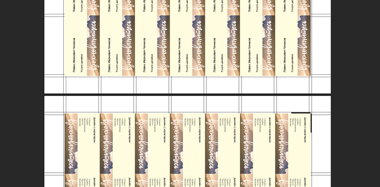
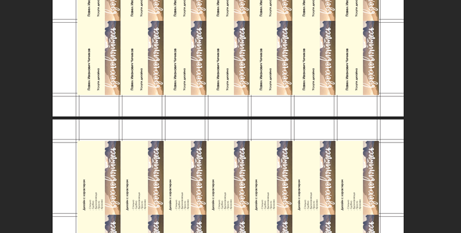
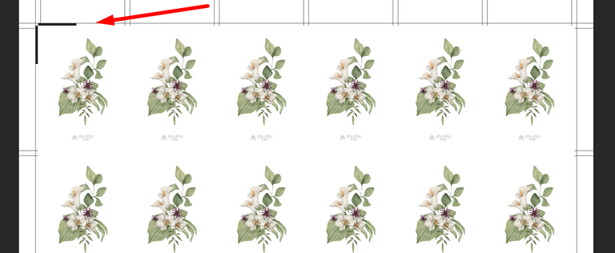
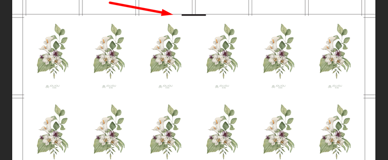
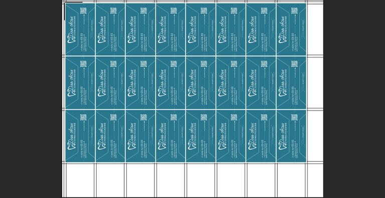
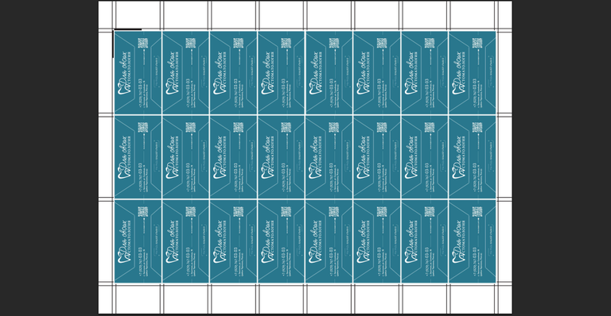

# Настройки спуска

Перед отправкой на печать необходимо настроить параметры спуска. Этот раздел интерфейса позволяет настроить три ключевых параметра: Расположение оборота, Полоса и Выравнивание спуска

<figure>

.png>)

<figcaption>

</figcaption>

</figure>

Оптимальные настройки позволяют:

-  Экономить бумагу (минимизировать обрезные отходы).

-  Избежать ошибок при печати (например, перевёрнутые страницы).

-  Оптимизировать процесс постпечатной обработки (резка, брошюровка).

### **Расположение оборота**

Этот параметр определяет ориентацию оборотной стороны относительно лицевой при двусторонней печати.

-  **По короткой стороне** – лист переворачивается вертикально, как страница книги.

-  **По длинной стороне** – лист переворачивается горизонтально, как календарь или блокнот.

[tabs]

[tab:По короткой стороне]

{width=768px height=378px}

[/tab]

[tab:По длинной стороне]

{width=768px height=389px}

[/tab]

[/tabs]

### **Полоса**

Чёрная полоса служит ориентиром для правильного совмещения страниц при печати.

-  **Левый верхний угол** – полоса размещается в левом верхнем углу (страницы могут быть повёрнуты относительно друг друга).

-  **Сверху** – полоса располагается в верхней части листа (верх первой страницы совпадает с верхом второй).

[tabs]

[tab:Левый верхний угол]

{width=768px height=316px}

[/tab]

[tab:Сверху]

{width=768px height=317px}

[/tab]

[/tabs]

### **Выравнивание спуска**

Определяет, как страницы группируются на печатном листе.

-  **По левому краю** – выравнивание по левой стороне (используется, когда важна жёсткая привязка к краю).

-  **По центру** – изделия центрируются на печатном листе (подходит для симметричного расположения с равными полями)

[tabs]

[tab:По левому краю]

{width=768px height=396px}

[/tab]

[tab:По центру]

{width=768px height=398px}

[/tab]

[/tabs]

После выбора параметров нажмите кнопку **"Сохранить"**  .png>), чтобы применить изменения.