# Шаблоны email-писем

## Общие положения

На сайте предусмотрена автоматическая отправка электронных писем. Письма отправляются по определенному шаблону, как клиенту, так и пользователю (менеджеру) сайта.\
Отправка писем настраивается в [настройках почтового сервера](./nastroika-pochtovogo-servera).\
В данном разделе можно настроить шаблон (текст) писем и отключить отправку некоторых из них.

:::note 

Письма отправляются только по заранее заданному шаблону и только автоматически.\
Нельзя написать и вручную отправить письмо из админ-панели сайта.

:::

### Письма клиенту

Перечень писем, которые может получить клиент:

-  Связанные с заказом (1)

[tabs]

[tab:Счёт на оплату]

При оформлении заказа со способом оплаты «Оплата по счету», можно отправить счет на электронную почту.

Базовый шаблон письма:

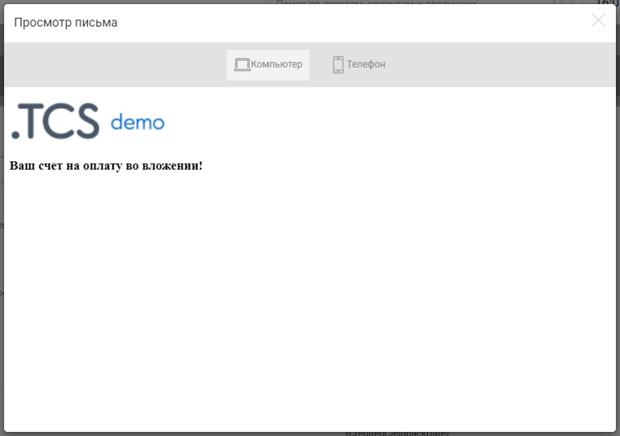{width=768px height=540px}

[/tab]

[tab:Изменение статуса зказа]

При изменении статуса заказа, клиент получит уведомление.

Базовый шаблон письма:

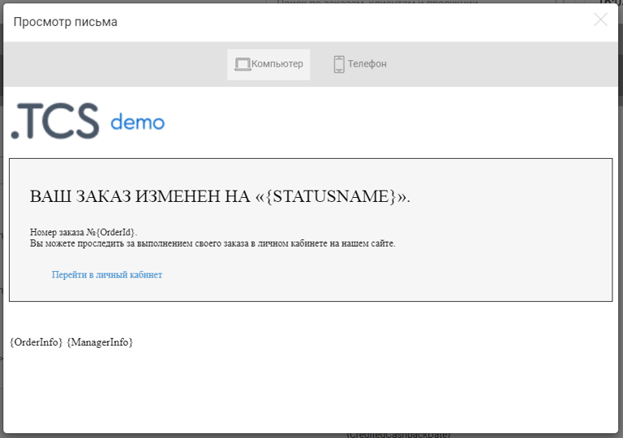{width=768px height=540px}

[/tab]

[tab:Новый заказ]

При размещении на сайте нового заказа, клиент получит уведомление.

Базовый шаблон письма:

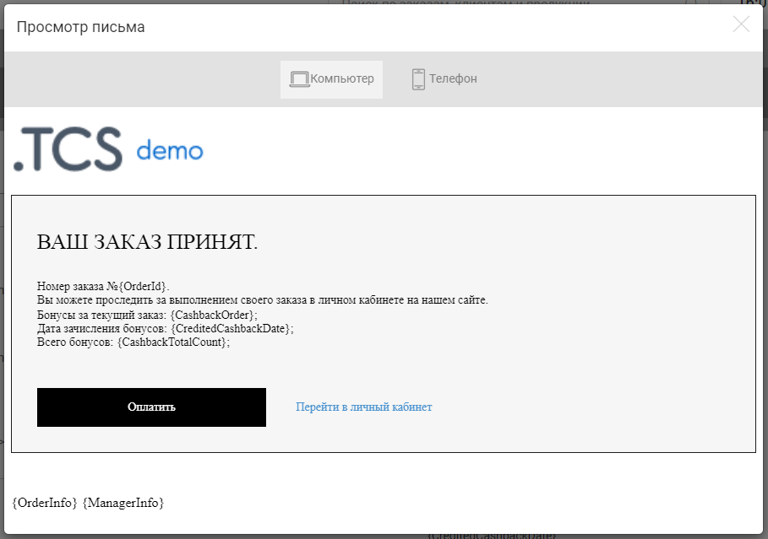{width=768px height=539px}

[/tab]

[tab:Оплата заказа]

При полной оплате заказа, клиент получит уведомление.

Базовый шаблон письма:

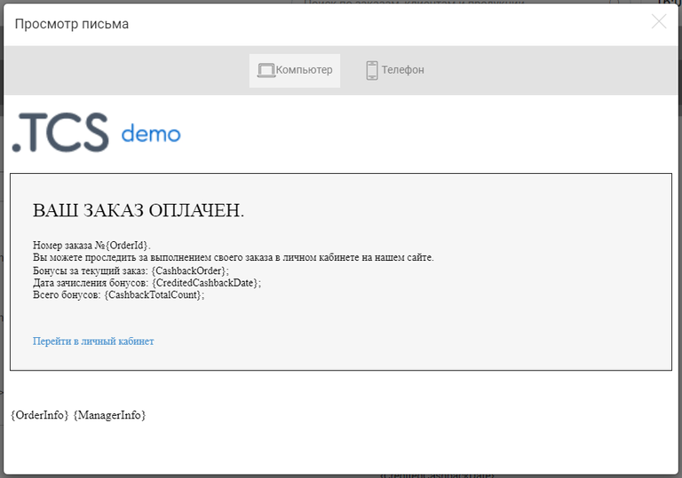{width=768px height=539px}

[/tab]

[/tabs]

-  Связанные с заказом (2)

[tabs]

[tab:Отбраковка макета]

Если загруженный клиентом макет был отбракован, клиент получит уведомление.

Базовый шаблон письма:

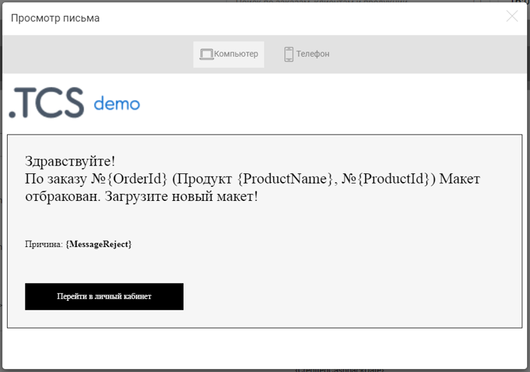{width=768px height=539px}

[/tab]

[tab:Неоплаченный заказ]

Если клиент разместил заказ на сайте, но так и не оплатил его, клиент будет периодически получать напоминание о том, что заказ не оплачен. Всего будет отправлено 3 письма -- через 1, 2 и 4 дня с момента размещения заказа.

:::info 

Отправку данного письма можно отключить.

:::

Базовый шаблон письма:

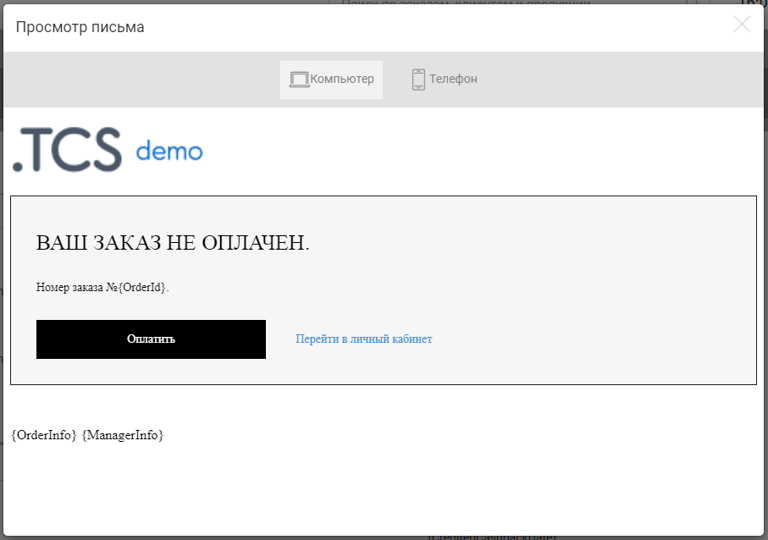{width=768px height=540px}

[/tab]

[tab:Напоминание загрузить макет]

Если клиент разместил заказ на сайте, но так и не загрузил макет, клиент будет периодически получать напоминание о том, что макет не загружен. Всего будет отправлено 3 письма -- через 1, 2 и 4 дня с момента размещения заказа.

:::info 

Отправку данного письма можно отключить.

:::

Базовый шаблон письма:

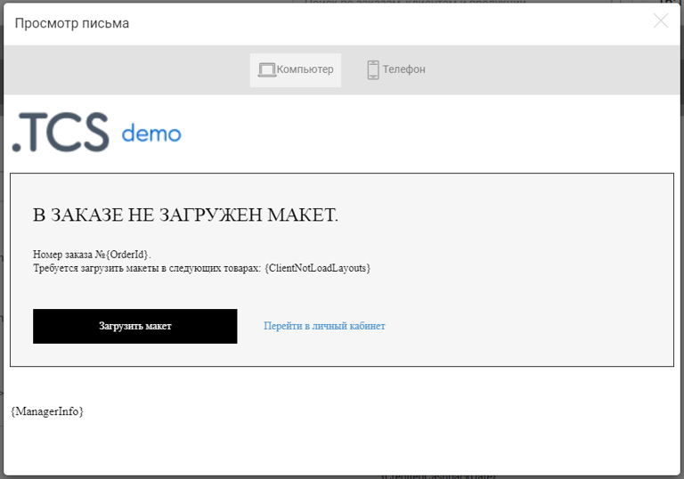{width=768px height=538px}

[/tab]

[tab:Удаление заказа]

Если заказ клиента по каким-то причинам был удален, клиент получит уведомление.

:::info 

Отправку данного письма можно отключить.

:::

Базовый шаблон письма:

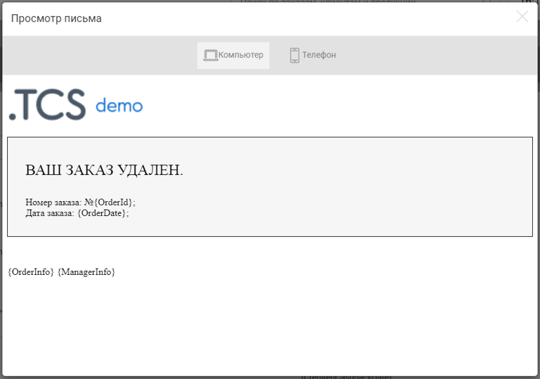{width=768px height=539px}

[/tab]

[/tabs]

-  Бонусы

[tabs]

[tab:Зачисление бонусов]

При ручном начислении бонусов на баланс клиента, клиент получит уведомление.

:::info 

Отправку данного письма можно отключить.

:::

Базовый шаблон письма:

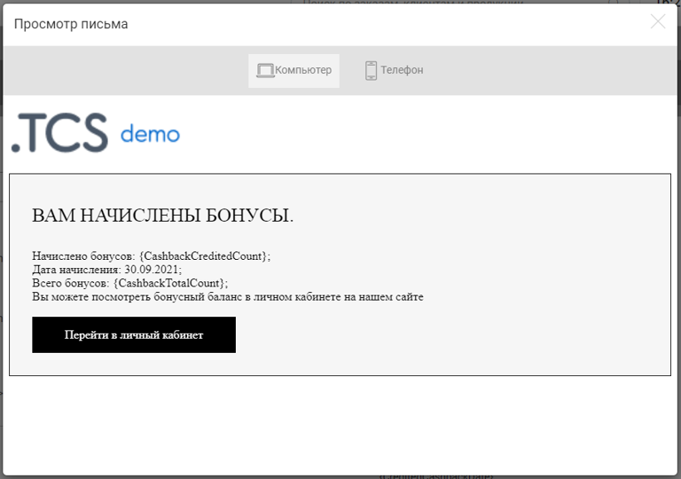{width=768px height=540px}

[/tab]

[tab:Сгорание бонусов]

Бонусы активны лишь ограниченное время, после чего они сгорают. За 14 дней до сгорания бонусов, клиент получит уведомление.

Базовый шаблон письма:

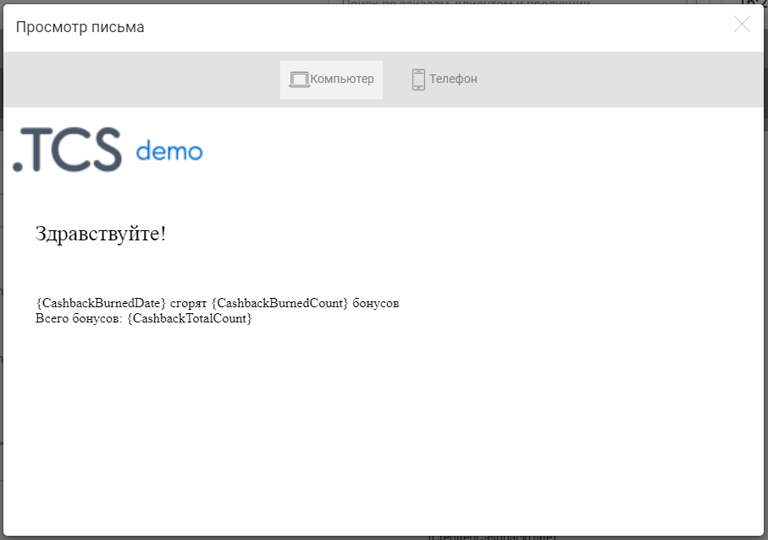{width=768px height=540px}

[/tab]

[/tabs]

-  Другие причины

[tabs]

[tab:Пополнение вн. баланса]

При пополнении внутреннего баланса клиента, клиент получит уведомление.

:::info 

Отправку данного письма можно отключить.

:::

Базовый шаблон письма:

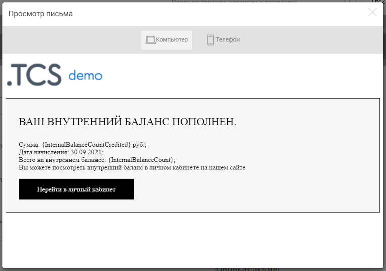{width=768px height=539px}

[/tab]

[tab:Письмо с паролем]

Если клиент, будучи не авторизованным на сайте, оформит заказ, то произойдет его принудительная регистрация и на его почту придет два письма: о новом заказе и письмо с паролем от его учетной записи.

Базовый шаблон письма:

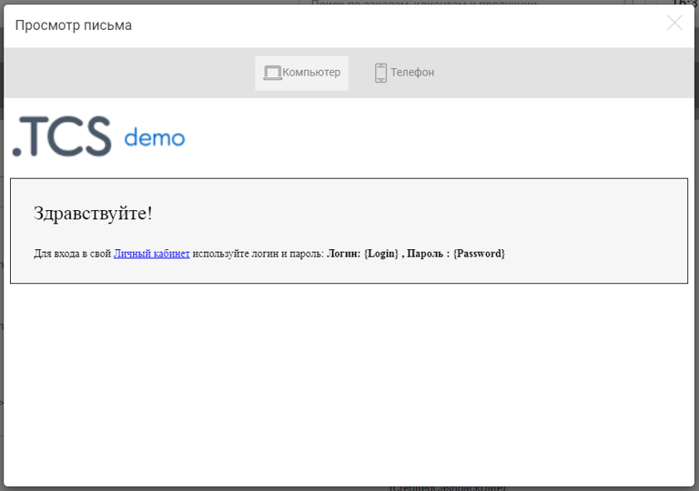{width=768px height=540px}

[/tab]

[tab:Восстановление пароля]

Если клиент забыл пароль от своей учетной записи, то он может воспользоваться формой «Забыли пароль?». На его почту придет письмо с новым случайным паролем.

Базовый шаблон письма:

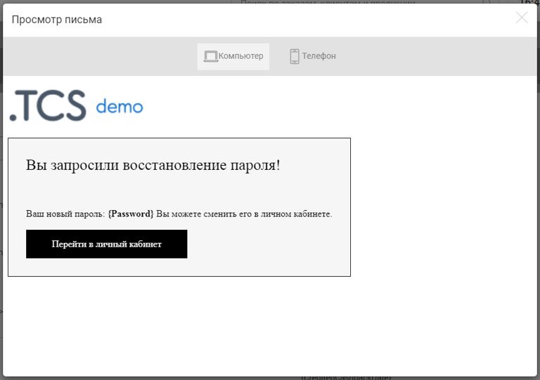{width=768px height=541px}

[/tab]

[tab:Подтверж. регистрации]

При заполнении формы регистрации на сайте, клиент получит письмо, в котором находится ссылка для подтверждения email-адреса.

Базовый шаблон письма:

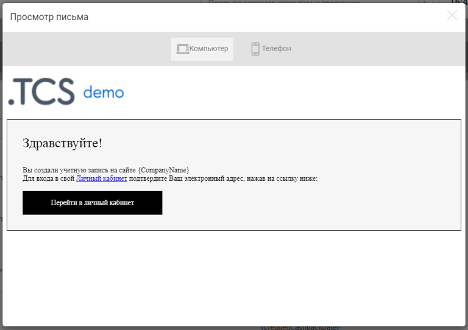{width=768px height=542px}

[/tab]

[tab:Вост. пароля с почтой]

Если клиент забыл пароль от своей учетной записи и при этом не подтвердил свой email-адрес, то при использовании формы «Забыли пароль?», клиент получит следующее письмо.

Базовый шаблон письма:

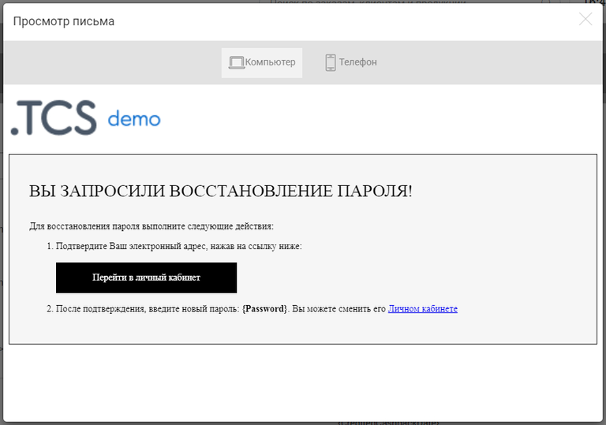{width=768px height=539px}

[/tab]

[/tabs]

### Письма пользователю сайта (менеджеру)

Перечень писем, которые может получить пользователь сайта (менеджер):

[tabs]

[tab:Новое обращение с сайта]

При поступлении нового обращения с сайта, ответственный менеджер получит уведомление. Если у клиента нет ответственного менеджера, то уведомление придет на почту типографии, указанную в [контактных данных](./kontaktnye-dannye).

:::info 

Данное письмо приходит лишь один раз в момент создания обращения.

:::

Базовый шаблон письма:

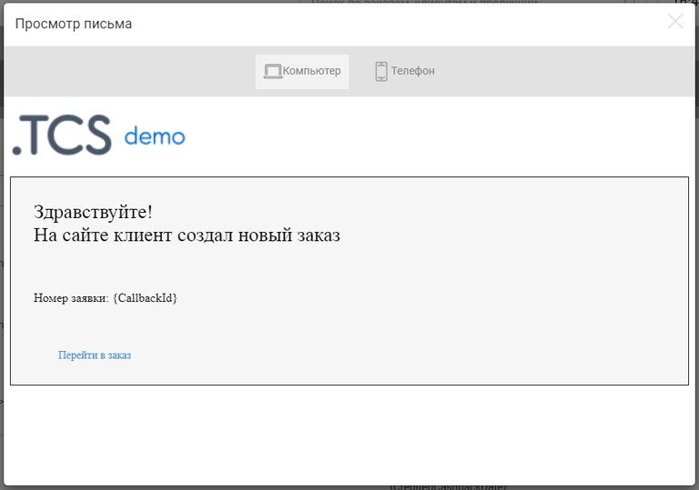{width=768px height=539px}

[/tab]

[tab:Новый заказ]

При поступлении нового заказа, ответственный менеджер получит уведомление. Если у клиента нет ответственного менеджера, то уведомление придет на почту типографии, указанную в [контактных данных](https://support.wow2print.com/nastroiki/drugie-nastroiki/kontaktnye-dannye).

:::info 

Данное письмо приходит лишь один раз в момент создания заказа.

:::

Базовый шаблон письма:

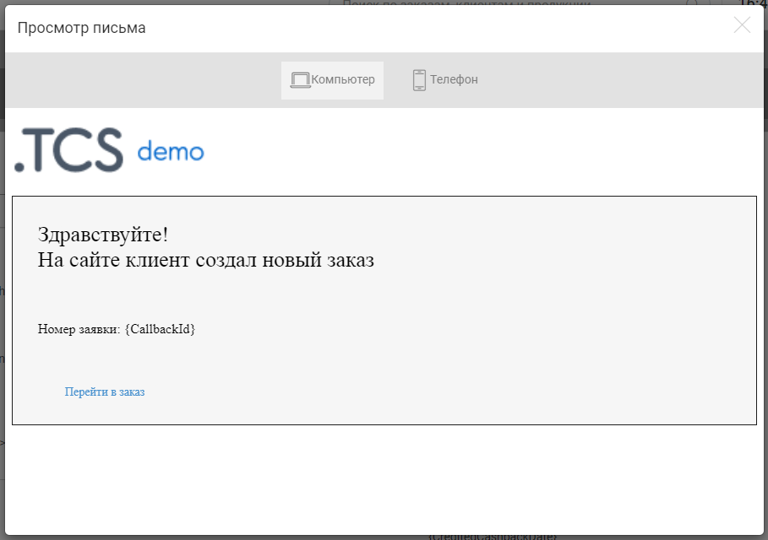{width=768px height=540px}

[/tab]

[/tabs]

### Редактирование шаблона

Любой из представленных шаблонов можно редактировать, для этого нажмите на его название.

.png>)

В левой части располагается:

-  **Title**\
   Будет отображаться как тема письма.

-  **Body**\
   Текст письма. Весь текст воспринимается как html-код.

В правой части располагаются теги, которые можно использовать в тексте письма:

-  **\{LogoUrl}**\
   Логотип сайта.

-  **\{CompanyName}**\
   Название компании -- берется из [контактных данных](./kontaktnye-dannye) из поля «Наименование, отображаемое в письмах».

-  **\{CompanyPhone}**\
   Телефон компании -- берется из [контактных данных](./kontaktnye-dannye) из поля «Контактный телефон типографии».

-  **\{CompanyEmail}**\
   Email компании -- берется из [контактных данных](./kontaktnye-dannye) из поля «Email типографии».

-  **\{CabinetUrl}**\
   Личный кабинет клиента -- ссылка для входа в ЛК.

-  **\{OrderInfo}**\
   Информация о заказе -- таблица с указанием всех позиций заказа.

-  **\{ManagerName}**\
   Имя менеджера.

-  **\{ManagerPhone}**\
   Телефон менеджера.

-  **\{ManagerEmail}**\
   Email менеджера.

-  **\{ManagerInfo}**\
   Информация о менеджере -- небольшой прямоугольный блок, в котором указаны: Фамилия, Имя, Email и Телефон менеджера.

-  **\{ClientFirstName}**\
   Имя клиента.

-  **\{ClientLastName}**\
   Фамилия клиента.

-  **\{ClientMiddleName}**\
   Отчество клиента.

-  **\{ClientEmail}**\
   Почта клиента.

-  **\{ClientPhone}**\
   Номер клиента.

-  **\{ClientPayer}**\
   Плательщик.

-  **\{CashbackTotalCount}**\
   Общее количество бонусов -- текущее количество бонусов клиента.

-  **\{CashbackOrder}**\
   Бонусы за текущий заказ.

-  **\{CreditedCashbackDate}**\
   Дата зачисления бонусов.

-  **\{ClientNotLoadLayouts}**\
   Не загруженные макеты клиента -- таблица с перечислением всех позиций, на которые необходимо загрузить макет.

-  **\{CashbackCreditedCount}**\
   Количество зачисленных бонусов.

-  **\{InternalBalanceCount}**\
   Сумма внутреннего баланса.

### Вернуть по умолчанию

Любому шаблону можно вернуть исходный вид с помощью кнопки «По умолчанию».

.png>)