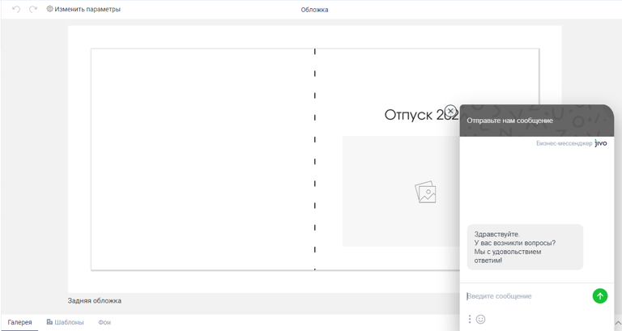

# Вставка кода в \<head> и \<body> сайта

## **Общее положение**

В данном разделе имеется четыре отдельных блока для размещения кода. Подсветки синтаксиса и проверки кода не предусмотрено, поэтому заранее убедитесь, что код корректен.

<figure>

.png>)

<figcaption>


</figcaption>

</figure>


#### **Блоки для размещения кода и их назначение**

-  **\<head> сайта**\
   **Что сюда размещать:** Код, который должен быть загружен в заголовке страницы. К примеру это мета-теги, канонические URL, код верификации сайта для поисковых систем (Яндекс.Вебмастер, Google Search Console) и некоторые виды трекеров.

-  **\<body> сайта**\
   **Что сюда размещать:** Скрипты и виджеты, которые должны отображаться или работать на всех страницах вашего сайта (но не в конструкторе товаров). Подходит для чат-ботов, виджетов обратного звонка, кнопок социальных сетей и т.п.

-  **\<body> конструктора**\
   **Что сюда размещать:** Код, который должен работать только внутри фоторедактора, редактора фотокалендарей или редактора полиграфии. Например скрипт с чат-ботом, или другим виджетом отображаемым в онлайн-редакторе.

-  **\<body> после контента**\
   **Что сюда размещать:** Скрипты, которые необходимо загружать в самом конце страницы, после всего основного контента и футера.


## Примеры размещения кода

:::note 

**Важно!** Коды сквозной аналитики **Яндекс.Метрики** и **Google Analytics** необходимо размещать в специальном разделе [Интеграции](./../integracii/_index#analitika). Это гарантирует их корректную работу.

:::


### **Бизнес-мессенджеры и чат-боты**

Коды большинства популярных чат-ботов (например, JivoSite, WhatsApp, Telegram) необходимо размещать в блок `**\<body>**` **сайта**, или при необходимости в `**\<body>**` **конструктора**.

-  **Пример для JivoSite:**

```
<script>
  (function(){var widget_id = 'your_widget_id';var s=document.createElement('script');
  s.type='text/javascript';s.async=true;s.src='//code.jivosite.com/script/widget/'
  +widget_id;var ss=document.getElementsByTagName('script')[0];ss.parentNode.
  insertBefore(s,ss);})();
</script>
```

[tabs]

[tab:Сайт]

{width=768px height=375px}

[/tab]

[tab:Конструктор]

{width=768px height=409px}

[/tab]

[/tabs]


### **Верификация сайта для поисковых систем**

Размещается в блоке \<head> сайта.

-  **Пример для Яндекс.Вебмастера**

```
<meta name="yandex-verification" content="your_verification_code"/>
```


### **OpenGraph**

OpenGraph-карточка служит неким превью сайта.

Вы, наверное, замечали, когда вы пытаетесь отправить кому-то ссылку на сайт, в чате автоматически подгружается к этой ссылке информация и даже изображение. Зачастую изображение подтягивается совершенно случайным образом и само превью на разных сайтах выглядит по-разному.\
OpenGraph позволяет в какой-то степени контролировать этот процесс -- можно вручную прописать код OpenGraph в head сайта, чтобы информация в превью была та, которую мы укажем.

.png>)


Пример кода OpenGraph:

```
<meta property="og:title" content="web-to-print TCS">
<meta property="og:description" content="Готовое web-to-print решение для онлайн типографии">
<meta property="og:image" content="https://ваш-домен.tcs.ru/images/og-image.jpg">
<meta property="og:url" content="https://demo.wow2print.com/">
<meta property="og:type" content="profile">
```

Подробнее о данной возможности можно узнать [здесь](https://yandex.ru/support/webmaster/open-graph/intro-open-graph.html)


## **Рекомендации и предупреждения**

-  **Внимательность:** Будьте осторожны при вставке кода. Неправильный код может привести к ошибкам в работе или отображении сайта.

-  **Производительность:** Большое количество тяжелых скриптов может замедлить загрузку вашего сайта.

-  **Безопасность:** Размещайте код только из доверенных источников.