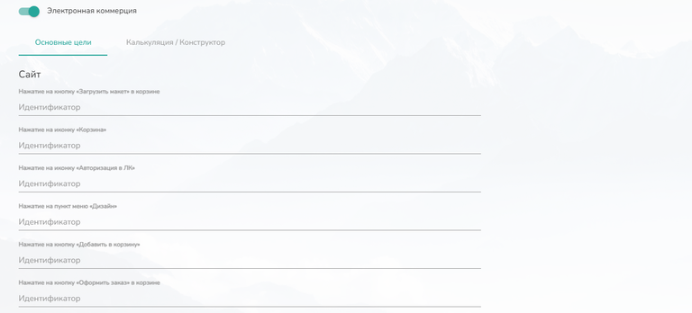
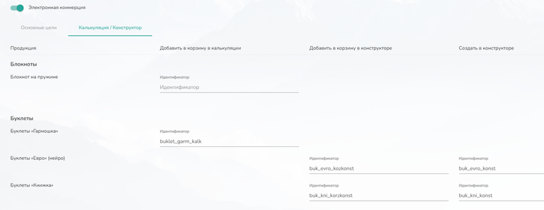
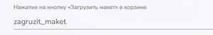

# Яндекс.Метрика

## Код счетчика

Чтобы связать сайт с Яндекс.Метрикой, необходимо разместить код счетчика Метрики в корень вашего сайта:

1. Перейдите на [metrika.yandex.ru](https://metrika.yandex.ru/) и авторизуйтесь (если у вас нет аккаунта -- зарегистрируйтесь).

2. Нажмите **«Добавить счётчик»**, укажите название, адрес сайта и другие параметры, затем нажмите **«Создать»**.

3. В списке счётчиков выберите нужный, перейдите в **«Настройки» -> «Счётчик»** и скопируйте код из раздела **«Код счётчика»**.

   .

<figure>

.png>)

<figcaption>

</figcaption>

</figure>

1. Вставьте этот код в интеграцию TCS "Яндекс Метрика" в поле "Код счетчика" и сохраните настройки.

.png>)

:::note 

Подробнее о работе с отчетами в Яднекс.Метрике можете ознакомиться на официальной странице справки Яндекса: <https://yandex.ru/support/metrica/reports/report-general.html#set-report>

:::

### 

## **Настройка целей для отслеживания кнопок**

Чтобы собирать статистику по нажатиям на кнопки сайта, вам нужно настроить "Цели" в Яндекс.Метрике. Это позволит отслеживать взаимодействия пользователей с важными элементами интерфейса.

Цели можно настроить только на те кнопки, которые указаны в настройках интеграции Яндекс.Метрики.

#### **Шаг 1: Активация и выбор типа цели**

1. В настройках интеграции TCS активируйте ползунок **«Электронная коммерция»**.

2. Перед вами откроется интерфейс для настройки целей. Он разделен на две вкладки:

-  **«Основные цели»:** содержит список основных действий на сайте (напр., «Корзина», «Оформить заказ», «Создать аккаунт»). Каждому действию соответствует поле для ввода идентификатора.

-  **«Калькуляция / Конструктор»:** содержит список товаров вашего сайта. Для каждого товара можно задать идентификаторы целей для следующих кнопок:

   -  Добавить в корзину в калькуляции

   -  Добавить в корзину в конструкторе

   -  Создать в конструкторе

   Если для товара недоступен конструктор, то идентификаторы "Добавить в корзину в конструкторе" и "Создать в конструкторе" будут скрыты.

[tabs]

[tab:Основные цели]

{width=768px height=348px}

[/tab]

[tab:Калькуляция / Конструктор]

{width=768px height=297px}

[/tab]

[/tabs]

#### **Шаг 2: Присвоение идентификаторов в TCS**

Для каждой цели, которую вы хотите отслеживать, необходимо придумать и вписать уникальный **Идентификатор**.

:::note 

**Требования к идентификатору:**

-  Только символы латинского алфавита (a-z).

-  Без пробелов.

{width=300px height=50px}

:::

#### **Шаг 3: Создание целей в Яндекс.Метрике**

Теперь нужно сообщить Яндекс.Метрике, какие идентификаторы отслеживать.

1. В личном кабинете Яндекс.Метрики перейдите в раздел **«Цели»** и нажмите **«Добавить цель»**.

2. Заполните форму:

   -  **Название:** Укажите понятное название цели (например, «Нажатие на Корзину»).

   -  **Тип условия:** Выберите обязательно **«JavaScript-событие»**.

   -  **Идентификатор цели:** Оставьте значение **«Совпадает»** и введите **тот самый идентификатор**, который вы указали в TCS (например, "cart").

3. Нажмите **«Добавить цель».**

<figure>

.png>)

<figcaption>

</figcaption>

</figure>

:::danger 

**Внимание!** Вам НЕ нужно копировать и куда-либо вставлять «код цели для сайта» из Метрики. TCS уже отправляет события с нужными идентификаторами.

:::

Повторите этот шаг для всех идентификаторов, которые вы внесли в TCS.

## **Просмотр отчетов**

После настройки целей и накопления данных вы сможете анализировать эффективность кнопок.

В Яндекс.Метрике перейдите в раздел **«Отчеты»** -> **«Все отчеты»** -> **«Конверсии».** Здесь вы можете детально изучить, сколько раз были достигнуты те или иные цели и их воронку.

<figure>

.png>)

<figcaption>

</figcaption>

</figure>

:::tip 

Более подробно о работе с отчетами по целям читайте в [официальной справке Яндекс.Метрики](https://yandex.ru/support/metrica/reports/goals.html?lang=ru).

:::

## **Видеоинструкция**

[Ссылка на VK Видео](https://vkvideo.ru/video-150544481_456239071)

[video:https://www.youtube.com/watch?v=xBko1ZPnZLg]