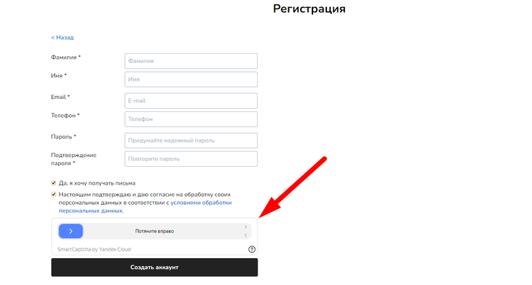
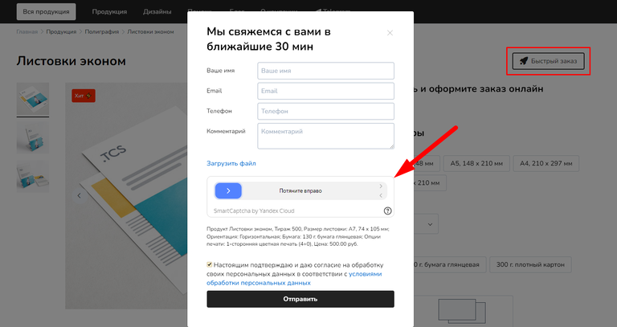

# Smart Captcha

**Yandex SmartCaptcha** -- это российский сервис защиты от спама и ботов, который помогает сайтам определить, кто заполняет формы: человек или робот.

Проверка часто проходит незаметно: обычно достаточно поставить галочку «Я не робот», а в безопасных случаях капча может не показываться вовсе.

Она автоматически активируется в ключевые моменты: при регистрации, авторизации или отправке форм обращений с сайта.

### Регистрация в Yandex Cloud

1. Перейдите на [cloud.yandex.ru](https://cloud.yandex.ru/) и авторизуйтесь или зарегистрируйте новый аккаунт

2. При первом входе потребуется:

   -  Подтвердить страну проживания

   -  Принять условия пользовательского соглашения (поставьте соответствующую галочку)

<figure>

<figcaption>

</figcaption>

</figure>

### Создание капчи

#### Шаг 1: Переход в раздел SmartCaptcha

После входа в Yandex Cloud:

1. Нажмите на иконку меню в левом верхнем углу

2. В открывшемся меню найдите раздел **«Безопасность»**

3. Нажмите на пункт **«SmartCaptcha»**

<figure>

.png>)

<figcaption>

</figcaption>

</figure>

#### Шаг 2: Инициализация создания

На странице SmartCaptcha нажмите кнопку **«Создать капчу»**.

<figure>

.png>)

<figcaption>

</figcaption>

</figure>

#### Шаг 3: Настройка параметров

Откроется редактор с двумя областями:

-  **Левая часть** -- настройки капчи

-  **Правая часть** -- предпросмотр различных состояний (по умолчанию, успешно, загрузка, ошибка)

<figure>

.png>)

<figcaption>

</figcaption>

</figure>

**Обязательные параметры:**

1. **Имя** -- укажите понятное название для идентификации в списке

2. **Список хостов** -- перечислите домены вашего сайта

   -  Формат: `example.com`, `subdomain.example.com`

   -  Без протокола (`https://`) и слеша в конце (`/`)

**Дополнительные настройки:**

-  **Внешний вид** -- настройте цветовое оформление под дизайн вашего сайта

-  **Сложность** -- выберите уровень защиты

-  **Типы заданий** (при необходимости показа):

   -  Распознавание текста

   -  Силуэты

   -  Калейдоскоп

<figure>

.png>)

<figcaption>

</figcaption>

</figure>

#### Шаг 4: Создание

Нажмите **«Создать капчу»** внизу страницы.

:::note 

Если это ваша первая капча и в аккаунте не привязана платёжная карта, откроется окно создания платёжного аккаунта. Создание платёжного аккаунта не обязательно, <mark style="background-color:$success;">**капча бесплатная**</mark>, поэтому можете пропустить поле «Платёжные данные» -- нажмите **«Создать»** без их заполнения.

:::

<figure>

.png>)

<figcaption>

</figcaption>

</figure>

### Подключение к сайту

#### Шаг 1: Получение ключей

1. В списке капч нажмите на только что созданную

2. Найдите раздел **«Обзор»**

3. Скопируйте два ключа:

   -  **Ключ клиента**

   -  **Ключ сервера**

<figure>

.png>)

<figcaption>

</figcaption>

</figure>

#### Шаг 2: Интеграция с TCS

1. В админ-панели сайта (Настройки -> Интеграции -> CAPTCHA) откройте интеграцию SmartCaptcha

2. В соответствующие поля вставьте:

   -  **Ключ доступа** -> Ключ клиента

   -  **Секретный ключ** -> Ключ сервера

<figure>

.png>)

<figcaption>

</figcaption>

</figure>

1. Сохраните изменения и убедитесь, что капча включена в списке Интеграций.

### Проверка работоспособности

После подключения:

-  Протестируйте формы на вашем сайте

-  Убедитесь, что капча корректно отображается при **регистрации** клиента и отправке **обращений с сайта**

[tabs]

[tab:Регистрация]

{width=768px height=412px}

[/tab]

[tab:Обращение с сайта]

{width=768px height=407px}

[/tab]

[/tabs]