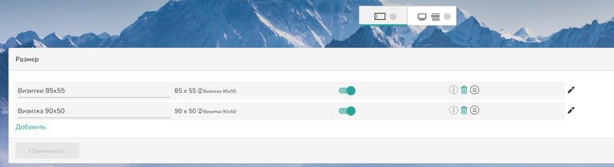
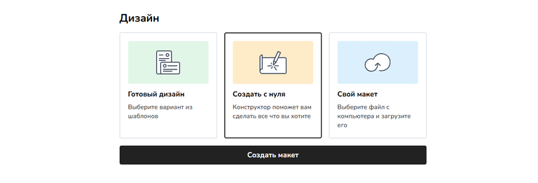
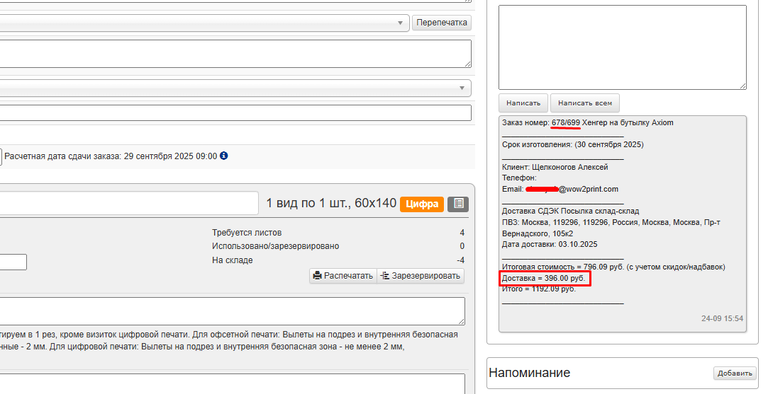
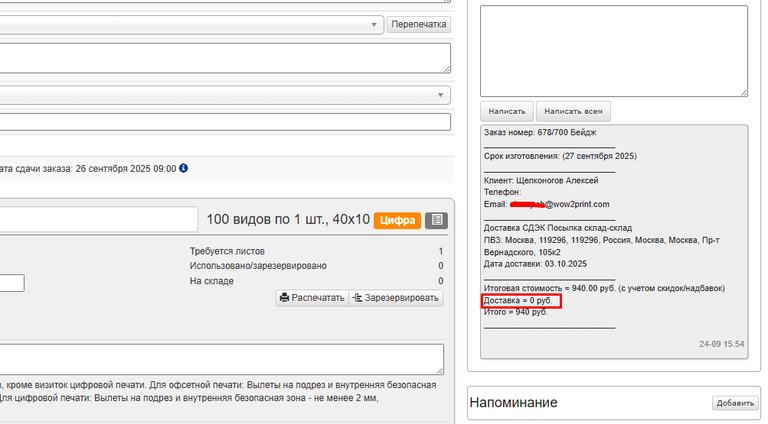

Админ. панель -> Настройки -> Интеграции -> CRM -> Axiom

**«Axiom»** -- **автоматическая система управления производством (АСУП) для полиграфии любого масштаба**. Она управляет допечатными, печатными и постпечатными процессами, контролирует скорость и качество работы, не допускает простоя оборудования.

<figure>

.png>)

<figcaption>

</figcaption>

</figure>

## **Настройки интеграции**

Во вкладке **«Настройки интеграции»** заполните обязательные поля для подключения к Axiom.

-  **Название**: Присвойте интеграции любое понятное имя. По умолчанию используется «Axiom».

-  **X_API_DOMAIN**: Укажите домен API. Данные предоставляет ваш интегратор Axiom.

-  **Ключ интеграции**: Уникальный ключ для доступа к API. Данные предоставляет интегратор.

-  **Кол-во дней производства**: Укажите дополнительное время на производство (в днях), если это необходимо.

<figure>

.png>)

<figcaption>

</figcaption>

</figure>

Выберите, при каких условиях заказы будут автоматически передаваться в АСУП:

-  **Макет принят**: Передача произойдет только после подтверждения макета менеджером в TCS.

-  **Заказ оплачен / гарантия оплаты**: Передача произойдет только после полной оплаты заказа клиентом или если менеджер установил в заказе гарантию оплаты.

:::info 

**Если ни одно из условий не отмечено**, то все заказы, содержащие товары из Axiom, будут передаваться в систему сразу после оформления.

:::

<figure>

.png>)

<figcaption>

</figcaption>

</figure>

После заполнения всех полей нажмите кнопку **«Сохранить»**.

### Интеграция продукта в систему TCS (Список калькуляторов)

После сохранения базовых настроек перейдите во вкладку **«Список калькуляторов»**. В ней автоматически загрузится перечень продуктов (калькуляторов), доступных для импорта из Axiom.

**Важно:** Для отображения продукта в списке, в его шаблоне в системе Axiom должен быть активирован параметр **«Доступен через API»**.

<figure>

.png>)

<figcaption>

</figcaption>

</figure>

#### **Чтобы добавить продукты на сайт:**

1. Отметьте галочками нужные продукты из списка.

2. Нажмите кнопку **«Сохранить»**.

**Примечания:**

-  Выбранные продукты появляются в разделе **«Продукция -> Без категории»**. Отсюда их необходимо вручную распределить по соответствующим категориям вашего сайта.

-  После добавления продукта галочка напротив него станет неактивной. Чтобы удалить продукт, необходимо сделать это в основном разделе [**«Продукция»**](https://support.wow2print.com/product/produkty#udalenie-produkta). После удаления, галочка в настройках интеграции снимется.

-  Для быстрого перехода к настройкам добавленного продукта нажмите на иконку блокнота.png>) справа от его названия.

<figure>

.png>)

<figcaption>

</figcaption>

</figure>

### **Синхронизация статусов заказов (Статусы)**

Во вкладке **«Статусы»** вы можете настроить сопоставление статусов между Axiom и TCS для их автоматической синхронизации.

-  В левой колонке указаны статусы из Axiom (например, «Получены файлы макетов», «Выполнен монтаж»).

-  В правой колонке, напротив каждого статуса Axiom, выберите соответствующий ему статус в TCS из выпадающего списка.

-  При изменении статуса заказа в Axiom его статус в TCS будет автоматически обновляться на выбранный.

Также отдельно настраивается статус для **удаленных заказов**. При удалении заказа в Axiom он будет перемещен в выбранный вами статус в TCS.

<figure>

.png>)

<figcaption>

</figcaption>

</figure>

## **Редактирование продукта Axiom в системе TCS**

В системе Axiom (Справочники -> Пользовательские шаблоны) создаются продукты, их модули и параметры. В TCS вы можете редактировать только их визуальное представление.

-  :::note 

   1. Удалить модули, созданные в Axiom, через TCS **нельзя**.

   2. **Нельзя редактировать** параметры, влияющие на расчет цены и сроков производства. Эти данные управляются исключительно через справочники в системе Axiom.

   :::

**Доступные для редактирования параметры модуля (во вкладке «Калькуляция» продукта):**

-  **Отображение заголовка:** Вкл/выкл переключатель «Показывать заголовок на сайте».

-  **Заголовок модуля:** Измените название модуля на сайте для клиентов.

-  **Описание:** Добавьте или измените текст описания модуля.

-  **Тип отображения параметров:** Выберите из списка: выпадающий список, радио-кнопки, иконки и т.д.

-  **Изображения параметров:** Загрузите свои иконки для значений параметров (кнопка «Загрузить иконку»).

-  **Название параметра:** Измените название значения параметра.

<figure>

.png>)

<figcaption>

</figcaption>

</figure>

### **Особенности редактирования модулей**

-  **Модуль «Тираж»:** Доступно только редактирование заголовка и его отображения на сайте.

<figure>

.png>)

<figcaption>

</figcaption>

</figure>

-  **Модуль «Цветность»:** 

   -  Добавление и удаление параметров цветности (из существующих в TCS).

   -  Загрузка иконок.

   -  Переименование параметров.

   -  Выбор отображения

   -  Смена заголовка на сайте и описание продукта

<figure>

.png>)

<figcaption>

</figcaption>

</figure>

:::note 

Модуль «Цветность» передается в TCS по-разному, в зависимости от версии продукта Axiom. В **версии 1** для этого необходимо вручную установить тип цветности «Произвольная». В **версии 2** модуль появляется автоматически.

.png>)

:::

#### **Добавление заголовков**

Для группировки параметров вы можете добавлять собственные заголовки. Нажмите кнопку **«+»** в правом нижнем углу, затем **«Добавить заголовок»** и в открывшемся окне введите нужный текст.

<figure>

.png>)

<figcaption>

</figcaption>

</figure>

#### **Сброс параметров модуля**

Чтобы отменить все внесенные вручную изменения и вернуть настройки модуля к исходным значениям из Axiom, нажмите на красную кнопку **«Вернуть настройки АСУП»**.

<figure>

.png>)

<figcaption>

</figcaption>

</figure>

### **Конструктор полиграфии (модуль «Размер»)**

Чтобы активировать конструктор полиграфии для продукта:

1. Убедитесь, что у вас заранее создан нужный [конструкторский размер](./../../../konstruktor/konstruktory/standart-poligrafiya) в TCS.

2. В калькуляции, в модуле «Размер» нажмите **«Добавить»**. Модуль всегда отображается первым в списке.

3. В появившемся окне «Создать новый размер» нажмите пункт **«Конструктор»** и выберите уже подготовленный размер.

4. Нажмите **«Создать»**.

:::note 

**Важно:** Для отображения конструктора в карточке товара **размеры и отступы изделия** в шаблоне TCS должны полностью совпадать с настройками шаблона в Axiom.

:::

[tabs]

[tab:В настройках калькуляции]

{width=768px height=209px}

[/tab]

[tab:На сайте]

{width=768px height=261px}

[/tab]

[/tabs]

#### **Сортировка модулей**

Используйте режим **«Сортировка для сайта»**, чтобы расположить модули в удобном и логичном для покупателя порядке. Порядок модулей в этом режиме напрямую повлияет на их отображение на витрине сайта.

<figure>

.png>)

<figcaption>

</figcaption>

</figure>

## **Оформление и отображение заказов в системе TCS**

-  **Публикация на сайте:** чтобы добавленный продукт стал виден клиентам, в категории товара (Админ.панель -> Продукция) необходимо включить переключатель **«Виден клиентам»**.

<figure>

.png>)

<figcaption>

</figcaption>

</figure>

-  **Оформление заказа:** процесс оформления заказа клиентом ничем не отличается от работы с обычными продуктами TCS.

-  **Отображение в TCS:** заказы на продукты Axiom отмечены в системе TCS соответствующей иконкой.

<figure>

.png>)

<figcaption>

</figcaption>

</figure>

-  **Передача в Axiom:** после создания заказа в TCS и при соблюдении условий, указанных в настройках интеграции, заказ автоматически передается в Axiom и отображается во вкладке **«Заказы»**.\
   После успешной передачи заказа в карточке заказа в TCS будет отображен номер, присвоенный ему в системе Axiom.

<figure>

.png>)

<figcaption>

</figcaption>

</figure>

### **Особенности передачи заказов:**

-  Разделение заказов: В систему Axiom передается не единый заказ из TCS, а каждый продукт Axiom отдельной позицией (заказом). Например, если в TCS создан заказ, содержащий 3 продукта, то в Axiom поступят 3 отдельных заказа.

<figure>

.png>)

<figcaption>

</figcaption>

</figure>

-  **Данные о доставке:** Информация о доставке (способ, адрес, цена) передается в комментарии каждого из созданных заказов.

-  **Стоимость доставки:** Чтобы избежать дублирования и ошибок в расчетах, общая стоимость доставки из заказа TCS будет содержаться в комментарии только к первому продукту в списке, который передается в Axiom.

[tabs]

[tab:Первый товар]

{width=768px height=394px}

[/tab]

[tab:Второй и третий товар]

{width=768px height=424px}

[/tab]

[/tabs]