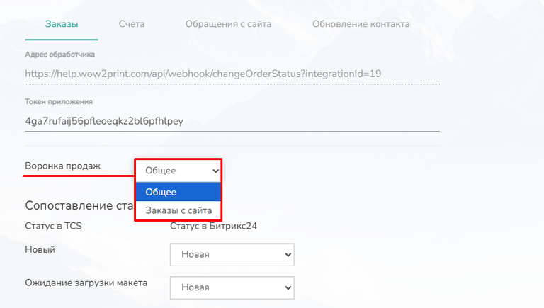
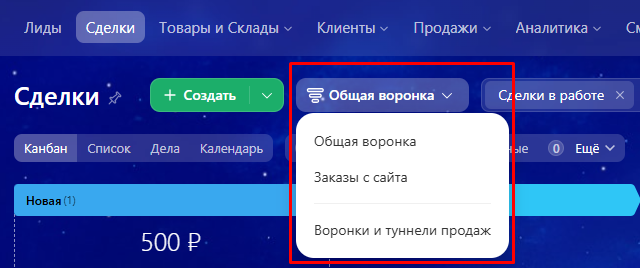
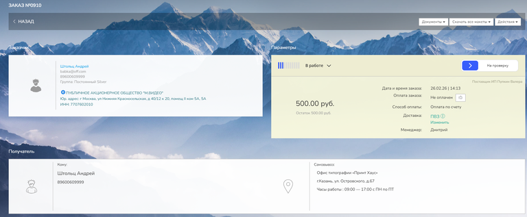
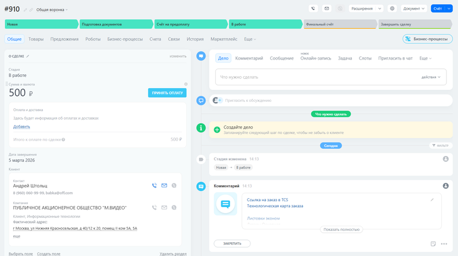
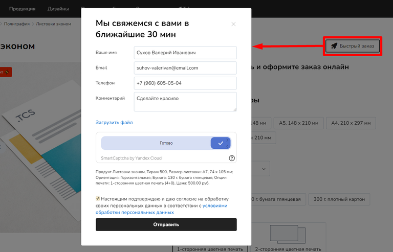
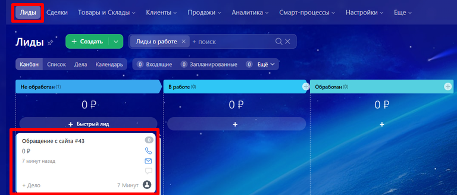

# Bitrix24 (Битрикс24)

Интеграция с Битрикс24 обеспечивает автоматическую синхронизацию данных о клиентах и заказах. Все заявки с сайта напрямую попадают в CRM, где фиксируются в карточках сделок и контактов, формируя единую базу и полную историю взаимодействия. Это позволяет типографии централизованно управлять продажами, контролировать прохождение заказов по этапам и оперативно ставить задачи сотрудникам, исключая риск потери заявок и необходимость ручного ввода данных.

## **Как подключить интеграцию**

Чтобы настроить связь между сайтом и Bitrix24, необходимо создать входящие и исходящие вебхуки (специальные ссылки для обмена данными). Ниже пошаговая инструкция.

#### Начало настройки

1. Перейдите в **Админ-панель** вашего сайта -> раздел **Настройки** -> **Интеграции** -> **CRM** -> **Bitrix24**.

2. Включите переключатель (тумблер), чтобы активировать интеграцию, и подтвердите действие.

<figure>

.png>)

<figcaption>

</figcaption>

</figure>

## Алгоритм внесения данных:

### Создание входящего вебхука (подключение к CRM)

Этот шаг нужен, чтобы сайт мог отправлять данные в Битрикс24.

1. Войдите в свой аккаунт Bitrix24.

2. В левом меню выберите **«Приложения»** -> **«Разработчикам»**.

3. Нажмите **«Другое»** -> **«Входящий вебхук»**.

<figure>

.png>)

<figcaption>

</figcaption>

</figure>

1. **Настройка прав:** В поле «Настройка прав» отметьте **Пользователи (user)** и **CRM (crm)**.

2. Скопируйте ссылку из поля **«Вебхук для вызова rest api»**.

3. Вернитесь в Админ-панель сайта и вставьте эту ссылку в поле с тем же названием.

4. Нажмите кнопку **«Сохранить»** в Админ-панели.

5. Вернитесь в Bitrix24 и нажмите кнопку **«Сохранить»**.

<figure>

.png>)

<figcaption>

</figcaption>

</figure>

### Настройка исходящих вебхуков (получение событий)

Теперь нужно настроить Bitrix24 так, чтобы он отправлял уведомления на сайт о том, что происходит в CRM (например, изменился статус сделки). Эти настройки выполняются для каждого типа данных: **Заказы**, **Счета**, **Обращения**, **Контакты**.

#### **Для синхронизации заказов**

1. В Админ-панели сайта -> Настройки -> Интеграции -> CRM -> Битрикс24, откройте вкладку **«Заказы»** и скопируйте **«Адрес обработчика»**.

2. В Bitrix24 снова зайдите в **«Разработчикам»** -> **«Другое»** -> **«Исходящий вебхук»**.

3. Вставьте скопированный адрес в поле **«URL вашего обработчика»**.

4. В разделе **«События»** выберите: *Создание сделки*, *Обновление сделки*, *Удаление сделки*.

5. Нажмите **«Сохранить»** в Bitrix24.

6. После сохранения скопируйте **«Токен приложения»** (он обновляется при сохранении).

7. Вернитесь в Админ-панель сайта, вставьте токен в поле **«Токен приложения»** и нажмите **«Сохранить»**.

<figure>

.png>)

<figcaption>

</figcaption>

</figure>

#### **Для синхронизации счетов**

1. В Админ-панели -> Настройки -> Интеграции -> CRM -> Битрикс24, перейдите на вкладку **«Счета»** и скопируйте **«Адрес обработчика»**.

2. В Bitrix24 создайте новый **«Исходящий вебхук»**.

3. Вставьте скопированный адрес в поле **URL вашего обработчика**.

4. В **«Событиях»** выберите: *Создание счета*, *Обновление счета*, *Удаление счета*, *Обновление статуса счета*.

5. Сохраните вебхук в Bitrix24, скопируйте новый **токен** и вставьте его в Админ-панели на вкладке «Счета». Сохраните изменения.

<figure>

.png>)

<figcaption>

</figcaption>

</figure>

#### **Для вкладки «Обращения с сайта»**

Повторите алгоритм для вкладки **«Обращения с сайта»**.

-  Скопируйте адрес обработчика из Админ-панели.

-  В Bitrix24 создайте исходящий вебхук, вставьте адрес.

-  Выберите события: *Создание лида*, *Обновление лида*, *Удаление лида*.

-  Сохраните, скопируйте токен и вставьте его в Админ-панели.

<figure>

.png>)

<figcaption>

</figcaption>

</figure>

#### **Для вкладки «Обновление контакта»**

Повторите алгоритм для вкладки **«Обновление контакта»**.

-  Скопируйте адрес обработчика из Админ-панели.

-  В Bitrix24 создайте исходящий вебхук.

-  Выберите события: *Создание контакта*, *Обновление контакта*, *Удаление контакта*.

-  Сохраните, скопируйте токен и вставьте его в Админ-панели.

<figure>

.png>)

<figcaption>

</figcaption>

</figure>

  

## Редактирование и Удаление вебхуков

При необходимости вы можете изменить или удалить созданные вебхуки:

1. Зайдите в аккаунт Bitrix24.

2. Перейдите в **«Приложения»** -> **«Разработчикам»** -> вкладка **«Интеграции»**.

3. Слева от номера ID нужного вебхука нажмите на значок **≡** (меню) и выберите **«Редактировать»** или **«Удалить»**.

<figure>

.png>)

<figcaption>

</figcaption>

</figure>

## **Сопоставление статусов**

1. Перейдите в Админ-панель сайта.

2. Последовательно пройдите по вкладкам **«Заказы»**, **«Счета»** и **«Обращения с сайта»**.

3. В каждой вкладке настройте **сопоставление статусов**: укажите, какому статусу в Bitrix24 соответствует статус на вашем сайте (и наоборот). Это обеспечит автоматическое обновление статусов в обеих системах.

4. Не забудьте сохранить изменения в каждой вкладке.

<figure>

.png>)

<figcaption>

</figcaption>

</figure>

## Дополнительная настройка

**Выгрузка клиентов:** На вкладке **«Заказы»** внизу есть кнопка **«Выгрузить базу клиентов из ТКС в Битрикс24»**. Она позволяет единоразово перенести всех существующих клиентов с сайта в CRM. Кнопка становится неактивной на 24 часа после нажатия.

<figure>

.png>)

<figcaption>

</figcaption>

</figure>

**Создание клиента при регистрации:** Если вы хотите, чтобы контакт в Bitrix24 создавался не только при оформлении заказа, но и при простой регистрации пользователя на сайте, на вкладке **«Обновление контакта»** активируйте ползунок **«Создание клиента при регистрации»**.

<figure>

.png>)

<figcaption>

</figcaption>

</figure>

## 

## **Принцип работы интеграции**

После настройки синхронизация работает автоматически по следующим правилам.

### Заказы (Сделки)

-  **Воронка продаж:** В настройках интеграции (вкладка «Заказы») можно выбрать конкретную воронку Битрикс24 (например, «Общая воронка» или созданная вами). Все новые заказы с сайта будут попадать именно в эту воронку.

[tabs]

[tab:В интеграции сайта]

{width=768px height=435px}

[/tab]

[tab:Битрикс24]

{width=640px height=268px}

[/tab]

[/tabs]

-  **Передача данных:** Когда клиент оформляет заказ на сайте, в Битрикс24 мгновенно создается сделка с общей информацией: состав заказа (товары), сумма, дата и данные клиента.

-  **Сопоставление статусов:** Благодаря настроенной таблице сопоставлений, изменение статуса заказа на сайте автоматически меняет статус сделки в Битрикс24. То же самое работает и в обратную сторону: если менеджер изменит статус в CRM, он обновится и на сайте.

[tabs]

[tab:Сайт]

{width=768px height=317px}

[/tab]

[tab:Битрикс24]

{width=768px height=430px}

[/tab]

[/tabs]

### Счета

-  Интеграция позволяет передавать данные для создания счета в Битрикс24.

-  Если клиент оплатит счет в Битрикс24, статус оплаты автоматически изменится и в соответствующем заказе на вашем сайте (согласно сопоставлению статусов оплат).

<figure>

.png>)

<figcaption>

</figcaption>

</figure>

### Обращения с сайта (Лиды)

-  На сайте можно настроить формы обратной связи. Когда клиент заполняет такую форму, в Битрикс24 создается новый **Лид**.

[tabs]

[tab:На сайте]

{width=768px height=493px}

[/tab]

[tab:Битрикс24]

{width=768px height=328px}

[/tab]

[/tabs]

-  Если клиент **не был авторизован** на сайте, информация из формы (имя, телефон, email) попадет в поля карточки лида.

<figure>

.png>)

<figcaption>

</figcaption>

</figure>

-  Если клиент **был авторизован**, заявка автоматически привяжется к существующему контакту в Битрикс24 по email. Информация о клиенте будет отображаться на вкладке **«Связи»**.

<figure>

.png>)

<figcaption>

</figcaption>

</figure>

### Обновление контакта

-  Вкладка отвечает за синхронизацию базы клиентов. При изменении данных клиента на сайте (например, он сменил номер телефона в личном кабинете) информация обновится и в связанном контакте Битрикс24, и наоборот.