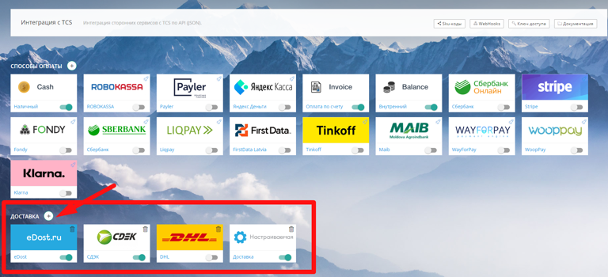
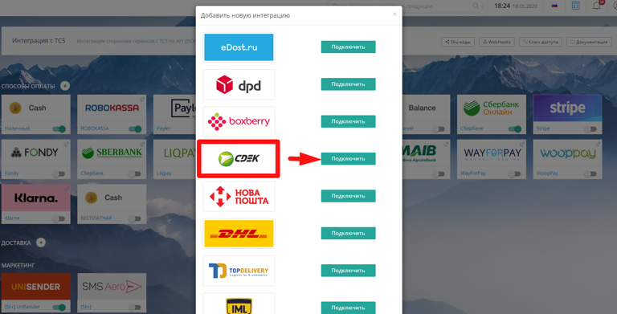
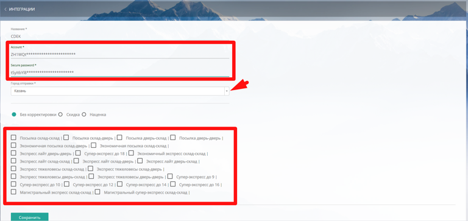
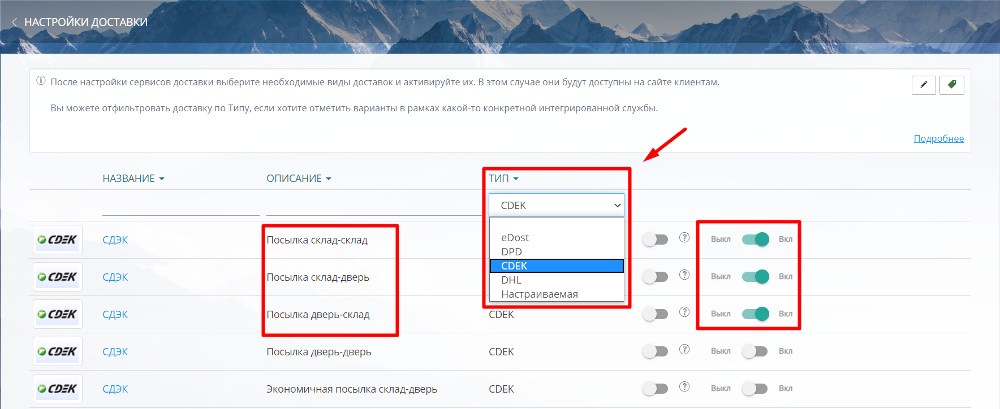
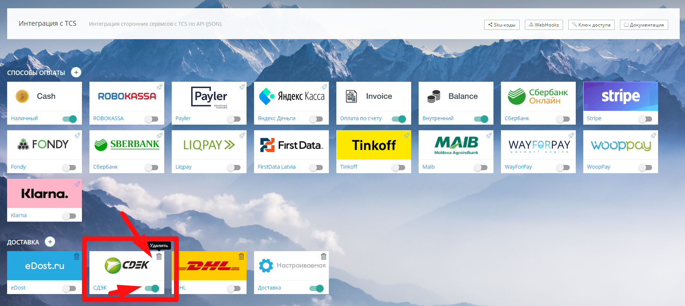

[view:hierarchy=none::::List]

Вы можете пройти интеграцию с транспортными компаниями или добавить свой вариант в

:::quote 

Настройки -> Интеграции -> Доставка

:::

Чтобы добавить доставку в Интеграции-> Доставки нажмите {width=37px height=34px}

{width=768px height=350px}

В списке возможных доставок, выберите нужную:

-  [eDost.ru](http://eDost.ru) (агрегатор доставок)

-  [DPD](./dpd)

-  [CDEK](./cdek)

-  Нова Пошта

-  DHL

-  Top Delivery

-  IML

-  UPS

-  Настраиваемая

:::danger 

**Надбавка**, устанавливаемая в [реквизитах компании](./../../oplata/rekvizity), распространяется исключительно на стоимость продукции и **не учитывается при формировании цены доставки.** Параметры налога (НДС) настраиваются в личном кабинете большинства сервисов доставки.

:::

## Способы доставки, для которых требуется обращение к поставщику услуг.

Для интеграции с транспортными компаниями ([**DPD**](./dpd)**,** [**Boxberry**](./boxberry)**,** [**CDEK**](./cdek)**, Нова Пошта, DHL, Top Delivery, IML, UPS**) и агрегатором доставок [**eDost.ru**](http://eDost.ru), предварительно обратитесь к ним для заключения договора и получения необходимых данных для интеграции (ключей доступа, accont, secure password, идентификатора магазина, api key и т.д.).

:::info 

**Внимание!** При заключении договора с транспортной компанией, обращайте внимание, чтобы договор был **для интеграции с онлайн-магазином**.

:::

### **Добавление интеграции доставки на сайт**

Чтобы добавить интеграцию с транспортной компанией, выберите в списке нужную компанию и нажмите "Подключить"

{width=768px height=391px}

### Выбор параметров доставки

В открывшемся окне выполните следующие действия:

-  Заполните *Название*

-  Введите *данные* для интеграции, полученные от транспортной компании

-  Выберите город отправки из списка

-  Установите *Скидку* или *Наценку* в рублях или процентах, если это требуется.

-  Выберите *способы доставки*, предусмотренные интеграцией с транспортной компанией

{width=768px height=363px}

После внесения всех данных, не забудьте их сохранить.

### Выбор способов доставки на сайте

После того, как интеграция с транспортной компанией пройдена,

:::quote 

в Настройки -> Доставки -> Способы доставки ->

:::

отсортируйте доставки по *Типу* и переключателями "Выкл./Вкл." активируйте те способы доставки, которые вы хотите отображать клиентам на сайте.

{width=1768px height=724px}

### Удаление интеграции на сайте

Вы можете включать и выключать интеграции для отображения на сайте при помощи переключателей напротив названия интеграции. Чтобы удалить интеграцию нажмите на иконку "Удалить".

{width=1831px height=820px}

## Настраивая доставка

Подробнее о настраиваемой доставке по ссылке ниже

<https://support.wow2print.com/nastroiki/integracii/dostavka/nastraivaemaya-dostavka>