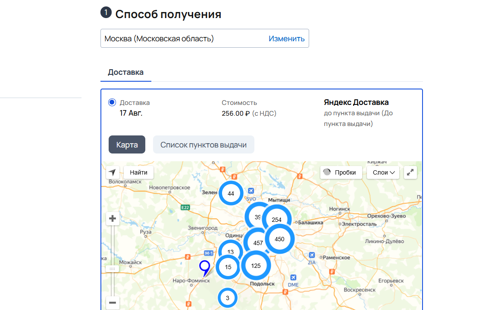
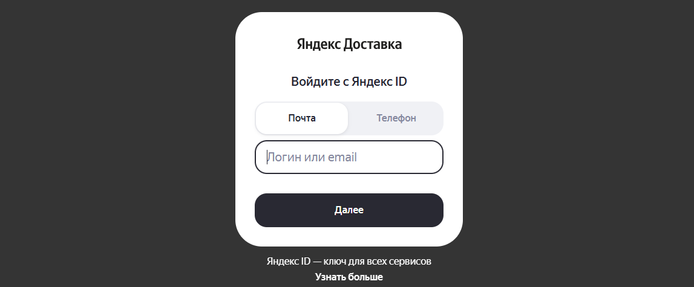
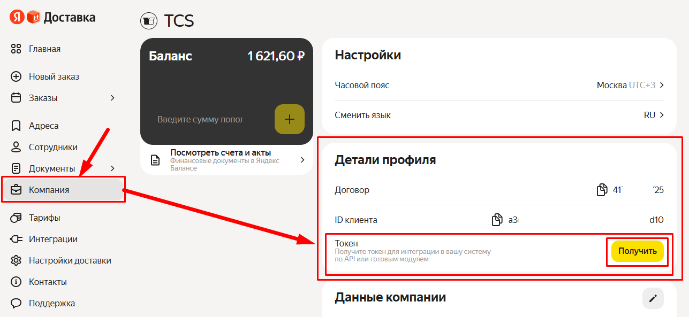
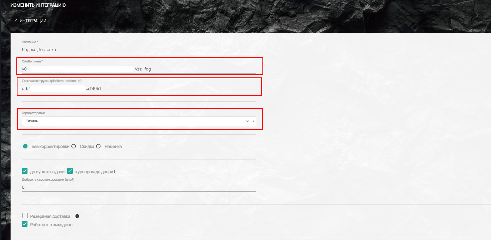
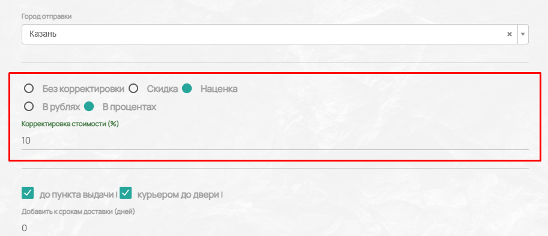
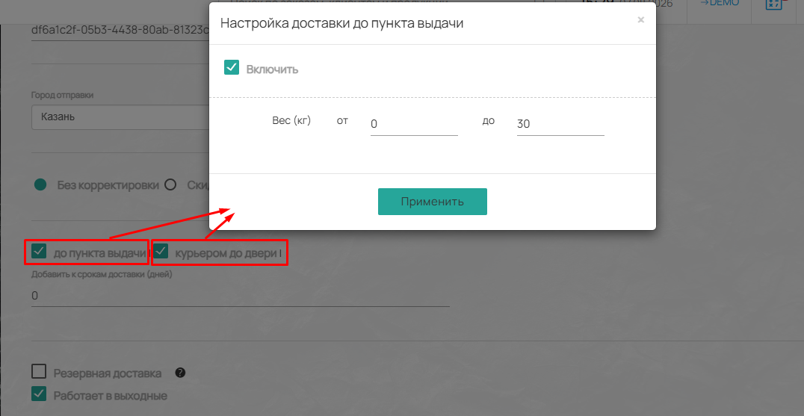
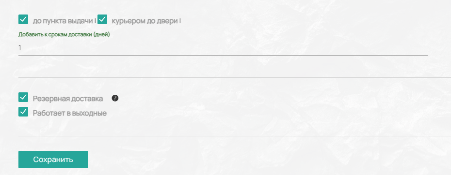
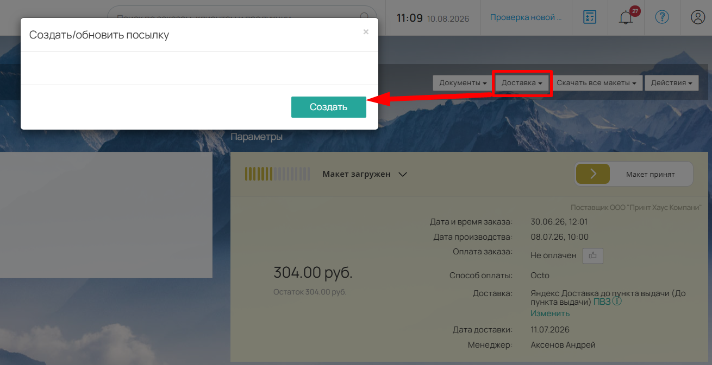
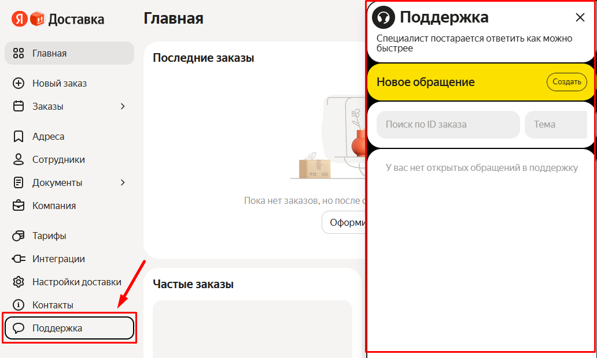

Эта статья поможет вам настроить интеграцию вашего сайта типографии с сервисом «Яндекс Доставка». Подключение выполняется в несколько шагов  в админ-панели вашего сайта (Настройки -> Интеграции -> Доставка).

## **Что потребуется:**

Для подключения интеграции вам понадобятся два ключевых параметра :

1. **OAuth-токен** -- он выдаётся в личном кабинете Яндекс Доставки.

2. **ID склада отгрузки (platform_station_id)** -- его нужно запросить в технической поддержке Яндекс Доставки.

{width=1162px height=721px}

## **Пошаговая инструкция**

### **Шаг 1. Подключите сервис «Яндекс Доставка» для бизнеса**

Если вы ещё не зарегистрированы в сервисе, сделайте это на сайте [Яндекс Доставки](https://dostavka.yandex.ru/personal-account/). После регистрации с вами свяжется менеджер для заключения договора.

{width=1147px height=475px}

### **Шаг 2. Получите OAuth-токен в личном кабинете**

1. Войдите в свой личный кабинет на сайте Яндекс Доставки.

2. Перейдите на вкладку «Компания» .

3. В разделе «Детали профиля» -> «Токен» нажмите кнопку **«Получить»** .

4. Скопируйте полученный токен. Сохраните его в надёжном месте.

{width=1287px height=593px}

:::note 

**Важно:** Если вы измените пароль от личного кабинета в Яндекс Доставке, ваш токен станет недействительным. В этом случае его нужно будет получить заново .

:::

### **Шаг 3. Получите ID склада отгрузки**

Этот идентификатор зависит от того, по какому сценарию вы планируете работать с доставкой :



---

*  **Сценарий**

*  **Что нужно сделать**

---

*  **«Курьером от вас»**

*  Запросите у техподдержки Яндекс Доставки [highlight:green]ID вашего склада[/highlight]. В этом случае необходимо заранее создавать платные отгрузки в календаре на даты, когда приедет курьер.

   [Подробнее в справке Яндекс Доставки.](https://yandex.ru/support/delivery-profile/ru/other-day/rules#tariff)

---

*  **«Вы относите сами»**

*  Запросите у техподдержки [highlight:green]ID ближайшего пункта выдачи (ПВЗ)[/highlight]. Вы сможете самостоятельно отправлять заказы в удобное время.

   [Подробнее в справке Яндекс Доставки.](https://yandex.ru/support/delivery-profile/ru/other-day/rules#sorting-center)



### **Шаг 4. Настройте интеграцию в ТКС**

1. Перейдите в меню **«Настройки -> Интеграции -> Доставка»** .

2. В поле для OAuth-токена вставьте скопированный ключ.

3. В поле для ID склада отгрузки укажите идентификатор, полученный от поддержки Яндекс Доставки.

4. Укажите «Город отправления».

{width=1768px height=865px}

### **Дополнительные настройки интеграции**

Вы можете управлять условиями доставки через дополнительные параметры.

**Настройка ценообразования**

В интеграции доступны три варианта на выбор:

**«Без корректировки» --** Стоимость доставки отображается клиенту в том виде, в котором её рассчитывает сервис Яндекс Доставки.

**«Скидка» --** Вы можете установить  скидки на доставку (в рублях или процентах), чтобы сделать предложение более привлекательным для клиентов.

**«Наценка» --** Позволяет добавить процент или сумму к стоимости доставки.

{width=912px height=393px}

**Настройка видов доставки**

Для выбора доступных клиентам способов получения заказа предусмотрены две галочки:

-  **«До пункта выдачи»** -- клиент может забрать заказ самостоятельно в ближайшем ПВЗ.

-  **«Курьером до двери»** -- заказ доставляется курьером по указанному адресу.

При активации каждого из этих способов откроется окно дополнительной настройки, где необходимо указать диапазон веса заказа **«от и до»** в килограммах. Это нужно для того, чтобы система корректно определяла возможность доставки в зависимости от веса готовой продукции.

{width=1076px height=557px}

**Корректировка сроков доставки**

Ниже расположено поле **«Добавить к срокам доставки (дней)»**. Эта настройка позволяет добавить дополнительные дни к стандартному сроку доставки, рассчитанному Яндексом. Это может быть полезно, если вам нужно заложить время на дополнительную обработку заказа.

**Дополнительные условия**

В самом низу раздела находятся две важные настройки:

-  **«Резервная доставка»** -- активирует этот способ доставки в качестве запасного. Если по какой-либо причине ни одна из других подключённых интеграций доставки не будет доступна (например, временный сбой сервиса), система автоматически переключится на резервный вариант. 

-  **«Работает в выходные»** -- эта галочка влияет на корректность расчёта сроков доставки. Если ваша типография или курьерская служба могут осуществлять доставку в субботу и воскресенье, отметьте эту опцию. Если галочка не установлена, система будет рассчитывать сроки доставки только по рабочим дням, согласно производственному календарю.

{width=930px height=362px}

 

## **Как проверить работу интеграции**

1. Создайте тестовый заказ на сайте, выбрав способ доставки «Яндекс Доставка».

2. Убедитесь, что стоимость доставки рассчитывается корректно после ввода адреса .

3. В оформленном заказе нажмите в меню сверху «Доставка» -> «Создать/Обновить посылку» -> «Создать».

4. Проверьте, что заявка на доставку в ЛК Яндекс Доставки создалась корректно.

{width=1310px height=673px}

## **Дополнительная информация**

Если у вас возникли вопросы при настройке, вы всегда можете обратиться в службу поддержки Яндекс Доставки через личный кабинет или в нашу [службу поддержки платформы](https://tippo.okdesk.ru/).

{width=1032px height=620px}