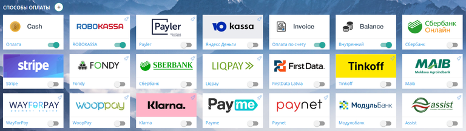
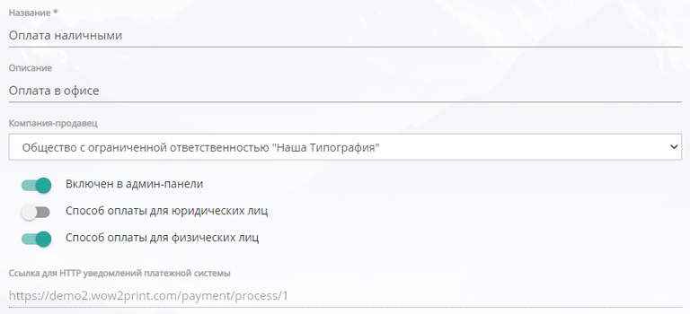
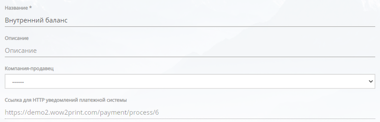
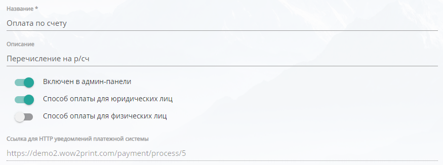
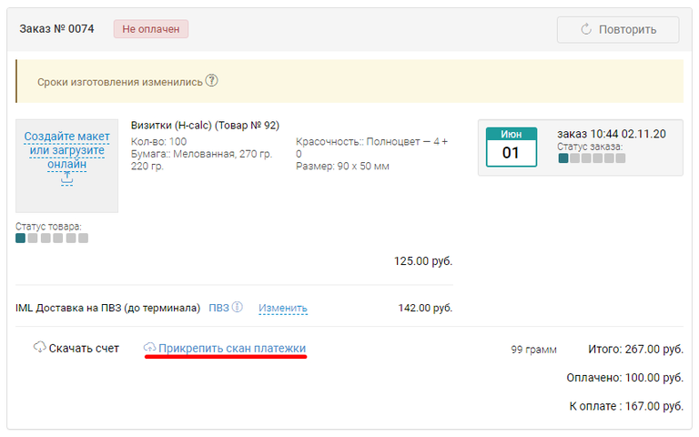
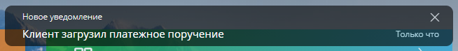
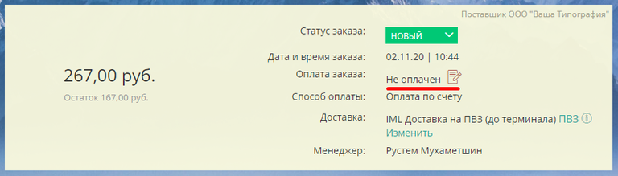

[view:hierarchy=none::::List]

## Способы оплаты

Любой интернет-магазин подразумевает онлайн оплату заказа. В данном разделе представлены, доступные для подключения, способы оплаты заказа.

{width=768px height=216px}

Оплатить заказ можно, как картой онлайн (интернет-эквайринг), так и без нее (прочие способы)

## Картой онлайн (интернет-эквайринг)

Данные способы оплаты предусматривают заключение договора и регистрацию на сайте платежной системы.

В админ-панели TCS имеются готовые интеграции для различных решений эквайринга: ROBOKASSA, Payler, Ю.Касса, Сбербанк, Stripe, FONDY, Liqpay, First Data, Tinkoff, MAIB, WayForPay, Klarna, Payme, Paynet, МодульБанк и Assist. 

Для настройки каждого из них требуются соответствующие ключи интеграции, их вы можете получить после регистрации в личном кабинете сайта платежной системы

Более подробно о каждом варианте можно узнать по соответствующим ссылкам: 

-  **ROBOKASSA (РОБОКАССА):**

   -  **Подробнее** в разделе: [ROBOKASSA (РОБОКАССА)](./robokassa)

-  **Ю.Касса (ЮKassa):**

   -  Сайт: <https://yookassa.ru/>

   -  Инструкция по регистрации: <https://yookassa.ru/docs/support/payments/onboarding>

-  **Tinkoff:**

   -  Сайт: <https://www.tinkoff.ru/business/internet-acquiring/>;

   -  Инструкция <https://help.tinkoff.ru/internet-acquiring/start-ia/> -> "Как подключить магазин к интернет- эквайрингу".

-  **Payler:**

   -  Сайт: <https://payler.com/>;

   -  Инструкция: <https://payler.com/docs/acquiring.html>.

-  **Stripe:**

   -  Сайт: <https://stripe.com/>;

   -  Инструкция: <https://stripe.com/docs>.

-  **Fondy:**

   -  Сайт: <https://fondy.ru/>;

   -  Инструкция: <https://fondy.ru/faq/>.

-  **Liqpay:**

   -  Сайт: <https://www.liqpay.ua/>;

   -  Инструкция: <https://www.liqpay.ua/> -> раздел на Главной "Как подключиться".

-  **FirstData:**

   -  Сайт: <https://www.firstdata.com/>.

-  **Maib:**

   -  Сайт: <https://www.maib.md/>.

-  **WayForPay:**

   -  Сайт: <https://wayforpay.com/ru>;

   -  Инструкция: <https://wiki.wayforpay.com/> -> "Создание магазина/партнера".

-  **WoopPay:**

   -  Сайт: <https://www.wooppay.com/>;

   -  Инструкция: <https://woopkassa.kz/> -> Получить консультацию.

-  **Klarna:**

   -  Сайт <https://www.klarna.com/>.

-  [**Paynet.md**](http://Paynet.md)**:**

   -  Сайт: <https://paynet.md/>.

-  **МодульБанк:**

   -  Сайт <https://modulbank.ru/onlinestore/>.

:::info 

Интернет эквайринг предполагает, что отметка об оплате заказа (статус оплаты заказа), в админ-панели TCS, будет проставляться автоматически после поступления денежных средств.

:::

## Прочие способы оплаты

Данные способы оплаты не предусматривают заключение договора и регистрацию на сайте платежной системы.

К ним относятся: Cash (оплата наличными), Внутренний баланс, Оплата по счету.

### Cash (оплата наличными)

Данный способ оплаты подразумевает оплату заказа непосредственно в офисе/ПВЗ компании.

Окно настроек выглядит следующим образом:

{width=768px height=350px}

-  *Название* -- Название способа оплаты, которое будет видеть клиент на сайте;

-  *Описание* -- Описание способа оплаты, которое будет видеть клиент на сайте;

-  *Компания-продавец* -- компания (настраивается в [Реквизитах](https://support.wow2print.com/settings/oplata/rekvizity)), которая будет указываться в товарном чеке;

   -  *Включен в админ-панели* -- данный способ оплаты будет доступен при калькуляции в админ панели;

   -  *Способ оплаты для юридических лиц* -- доступен для оплаты юридическим лицам;

   -  *Способ оплаты для физических лиц* -- доступен для оплаты физическим лицам.

:::note 

При оплате наличными статус оплаты заказа необходимо изменять вручную. 

:::

:::info 

В самом заказе будет активная кнопка "Оплатить". При получении денежных средств от клиента, необходимо нажать на эту кнопку, статус оплаты заказа сменится на Оплачен.

:::

### 

### Внутренний баланс

Данный способ оплаты подразумевает оплату заказа средствами с внутреннего баланса клиента.

Окно настроек выглядит следующим образом:

{width=768px height=247px}

-  *Название* -- Название способа оплаты, которое будет видеть клиент на сайте;

-  *Описание* -- Описание способа оплаты, которое будет видеть клиент на сайте;

-  *Компания-продавец* -- у данного способа оплаты нет привязки к конкретной компании-продавцу, так как внутренний баланс клиента может быть, как на ФЛ, так и на ЮЛ. Соответствующая компания-продавец подставляется автоматически. В данном случае необходимо оставить вариант "-------".

:::info 

При оплате с внутреннего баланса статус оплаты заказа изменяется автоматически. 

:::

### 

### Оплата по счету

Данный способ оплаты подразумевает оплату заказа путем перечисления денежных средств на расчетный счет компании-продавца.

Окно настроек выглядит следующим образом:

{width=875px height=326px}

-  *Название* -- Название способа оплаты, которое будет видеть клиент на сайте;

-  *Описание* -- Описание способа оплаты, которое будет видеть клиент на сайте;

   -  *Включен в админ-панели* -- данный способ оплаты будет доступен при калькуляции в админ панели;

   -  *Способ оплаты для юридических лиц* -- доступен для оплаты юридическим лицам;

   -  *Способ оплаты для физических лиц* -- доступен для оплаты физическим лицам.

:::note 

При оплате по счету статус оплаты заказа необходимо изменять вручную.

:::

:::info 

При выборе данного способа оплаты счет формируется автоматически и отправляется на email клиента. Счет формируется на основе данных, которые вы указали в разделе [Реквизиты](https://support.wow2print.com/settings/oplata/rekvizity). После поступления средств необходимо перейти в [Счета клиентов](https://support.wow2print.com/ecommerce/bukhgalteriya/scheta-klientov-debet) (Админ-панель -> Магазин -> Бухгалтерия -> Счета клиентов). Рядом с нужным вам счетом нажмите "Оплатить" -- статус оплаты заказа сменится на "Оплачен".

:::

### 

### Оплата по счету. Платежное поручение

Чтобы вам не проверять лишний раз поступление денежных средств на расчетный счет, у клиента имеется возможность сразу после оплаты добавить в заказ файл платежного поручения.

{width=768px height=480px}

После загрузки клиентом файла платежного поручения, вы получите соответствующее уведомление в админ-панели сайта.

{width=654px height=73px}

Файл платежного поручения можно скачать в самом заказе (кнопка рядом со статусом оплаты заказа)

{width=768px height=219px}