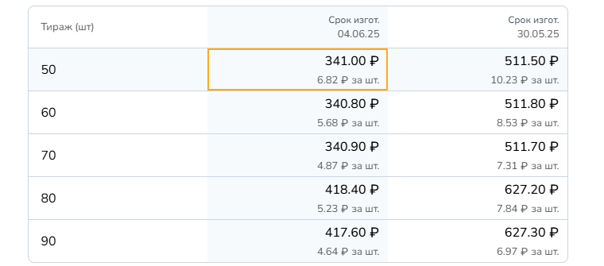
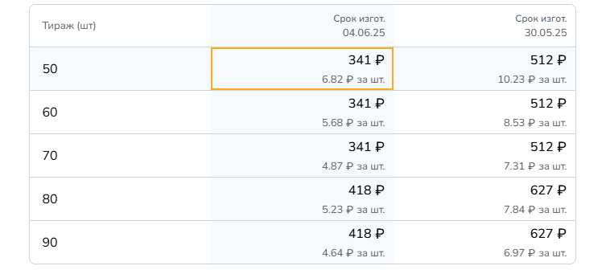

## **Мультивалютность. CRM**

Установите в данном разделе валюту, в которой по умолчанию будут отображены цены в справочнике.

<figure>

.png>)

<figcaption>

</figcaption>

</figure>

В отдельных операциях, материалах или комплектующих можно сменить валюту по умолчанию на любую другую.

.png>)

Если в операциях, материалах и т.д. установлена валюта по умолчанию, то при смене валюты для справочника, она так же изменится во всех операциях и материалах. 

Если же была установлена иная валюта (без пометки "по умолчанию") -- при смене основной валюты она не изменится.

## **Мультивалютность. Сайт**

Установите валюту, в которой по умолчанию будут отображены цены на сайте для клиента.

<figure>

.png>)

<figcaption>

</figcaption>

</figure>

Отображение валюты по умолчанию на сайте:

<figure>

.png>)

<figcaption>

</figcaption>

</figure>

Если вы хотите предоставить клиенту выбор -- возможность осуществлять калькуляцию и оформлять заказ в другой валюте -- отметьте галочками валюту, которая будет доступна для выбора на сайте.

<figure>

.png>)

<figcaption>

</figcaption>

</figure>

Отображение на сайте:

<figure>

.png>)

<figcaption>

</figcaption>

</figure>

Клиент может сменить валюту и произвести калькуляцию в желаемой для него валюте:

<figure>

.png>)

<figcaption>

</figcaption>

</figure>

## **Наценка и округление**

Для валюты, доступной клиенту на сайте, можно настроить наценку и округление:

-  Для валюты из справочника можно задать наценку к курсу.

<figure>

.png>)

<figcaption>

</figcaption>

</figure>

-  Для валюты на сайте, которую выбирает клиент, можно включить округление.

<figure>

.png>)

<figcaption>

</figcaption>

</figure>

Округление происходит до целых чисел. При округлении используется несколько общих математических правил: 

-  если цифра, следующая за разрядом округления, меньше 5, то округляемое число остается без изменений. 

-  Если следующая цифра равна или больше 5, то цифра округляемого разряда увеличивается на 1

**Пример:**

[tabs]

[tab:Без округления]

{width=760px height=335px}

[/tab]

[tab:С округлением]

{width=758px height=336px}

[/tab]

[/tabs]