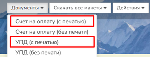
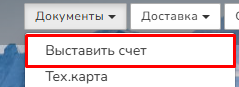

Инструкция по работе с реквизитами компании

## **Добавление реквизитов**

В этом разделе заполняются данные компании-продавца. Вы можете добавить:

-  Компании **без НДС**, с **НДС 5%** или **7%**;

-  Компании с **НДС 10%** или **20%**.

<figure>

.png>)

<figcaption>

</figcaption>

</figure>

Чтобы добавить реквизиты:

1. нажмите кнопку "Добавить новую компанию". 

2. В открывшемся окне заполните поля:

-  **Название** – отображается в разделе «Для ЮЛ».

-  **Полное наименование организации** – указывается в счетах и документах.

-  **ИНН** – идентификационный номер налогоплательщика.

-  **КПП** – код причины постановки на учёт.

-  **Адрес** – фактический адрес компании.

-  **Юридический адрес** – адрес регистрации компании (отображается в документах).

-  **ОГРН** – основной государственный регистрационный номер.

-  **ОКПО** - Общероссийский Классификатор Предприятий и Организаций

-  **Срок действия счета (в днях)** – период, в течение которого счет имеет юридическую силу

-  **Префикс (к счетам)** – префикс перед номером счёта (например, «А-»).

-  **Налог** – выберите ставку НДС (изменить позже нельзя).

-  **Система налогообложения** – порядок взимания налогов.

-  **Руководитель** – ФИО руководителя.

-  **Бухгалтер** – ФИО бухгалтера.

<figure>

.png>)

<figcaption>

</figcaption>

</figure>

1. Нажмите **«Сохранить»**.

После сохранения компания автоматически попадет в соответствующий раздел:

-  Компании без НДС, НДС 5% или 7%

-  Компании с НДС 10% или 20%

<figure>

.png>)

<figcaption>

</figcaption>

</figure>

Когда у типографии одновременно активированы компании с разными налоговыми режимами (без НДС и с НДС), система автоматически определяет, какие реквизиты компании использовать, исходя из типа покупателя:

-  Если заказчик физическое лицо или компания без НДС / с НДС 5% или 7% – то счёт будет выставлен от компании, которая работает без НДС или с НДС 5% или 7%;

-  Если заказчик Юридическое лицо с НДС 10% или 20% – то счёт будет выставлен от компании с НДС 10% или 20%.

### **Дополнительные настройки после создания:**

-  Для компаний **с НДС 10% или 20%** появится поле **«Надбавка (%)»** – процент надбавки к стоимости продукции.

-  Внизу страницы можно загрузить:

   -  **Печать организации**;

   -  **Подпись руководителя**;

   -  **Подпись бухгалтера**.

В последующих оформленных заказах, во вкладке **"Документы"**, после нажатия кнопки **"Счёт на оплату (с печатью)"**, **"УПД (с печатью)"** или **"Счёт-фактура (с печатью)"**, загруженные изображения появятся на документе в качестве печати и подписей. 

{width=300px height=114px}

Так же печать и подписи используются при формировании **"Акта сверки",** в **"Актах оказания услуг"** и в **"Товарных накладных".**

#### **Требования к изображениям:**

-  Формат: **PNG или JPG**;

-  Размер: \
   Для печати - **40×40 мм**;\
   Для подписи - **15х40 мм;**

-  Вес: **не более 200 КБ**.

<figure>

.png>)

<figcaption>

</figcaption>

</figure>

Пример отображения печатей и подписей в счёте на оплату:

<figure>

.png>)

<figcaption>

</figcaption>

</figure>

## Редактирование реквизитов

1. Нажмите на название компании, чтобы открыть форму редактирования.

2. Внесите изменения и сохраните их.

<figure>

.png>)

<figcaption>

</figcaption>

</figure>

## Добавление банковских реквизитов

:::note 

Для каждой компании обязательно должны быть указаны банковские реквизиты. Нельзя активировать компанию без них.

:::

К одной компании можно привязать несколько банков.

**Что бы добавить банк:**

1. В строке под текущим  банком нажмите **«Добавить»**.

<figure>

.png>)

<figcaption>

</figcaption>

</figure>

1. Далее заполните:

-  **БИК** – банковский идентификационный код;

-  **Название банка** – отображается в документах;

-  **Расчетный счет** -  банковский счёт, открытый юридическим лицом

-  **Корреспондентский счет** - это специальный технический счёт одного банка, через который проводятся расчёты между организациями.

-  **"Включен"** - если активирован, счета будут выставляться с этого банка.

1. Нажмите **«Сохранить»**.

<figure>

.png>)

<figcaption>

</figcaption>

</figure>

## **Настройка нумерации и типов документов**

### Сквозная нумерация

1. Нажмите **«Сквозная нумерация»** в строке компании.

2. В открывшемся окне укажите:

   -  **Начальный номер счёта** (по умолчанию: 1);

   -  **Начальный номер закрывающих документов** (по умолчанию: 1).

3. Нажмите **«Сохранить»**.

<figure>

.png>)

<figcaption>

</figcaption>

</figure>

### Тип документов

1. Нажмите **«Тип документов»** справа от кнопки "Сквозная нумерация".

2. Выберите из выпадающего списка:

   -  **Счёт-фактура и первичные документы**;

   -  **УПД (универсальный передаточный документ)**.

3. Нажмите **«Сохранить»**.

<figure>

.png>)

<figcaption>

</figcaption>

</figure>

## Активация компании

Чтобы включить или отключить компанию, используйте переключатель в конце её строки.

Одновременно можно активировать **только одну компанию с НДС** и **одну без НДС**.

:::note 

**Важно!** Хотя бы одна компания должна быть активна. Нельзя отключить все компании

:::

<figure>

.png>)

<figcaption>

</figcaption>

</figure>

## Настройки оплаты

1. Нажмите **«Настройки»** в правом верхнем углу.

<figure>

.png>)

<figcaption>

</figcaption>

</figure>

1. В открывшемся разделе настройте параметры:

-  **Выставление счёта**:

   -  *Автоматически* – счёт формируется сразу после заказа. (посмотреть и скачать можно в заказе, в меню "Документы".)

   -  *Вручную* – менеджер выставляет счёт вручную (в заказе, в меню "Документы" появится кнопка "Выставить счёт".).

{width=239px height=87px}

-  **Валюта счёта** – рубли, доллары и др. Выбранная валюта определяет форму счёта. Например, если вы укажете Молдову, форма счёта будет отличаться от российской.

-  **"Приравнять с НДС и без НДС (если включена только компания с НДС)** - если включено, на сайте отображается только одна цена с НДС.

-  **Подпись для счёта** – текст отображается под итоговой суммой в счёте.

-  **Шаблон** - определяет формат названия товара в графе "Товар" в счёте.

-  **Элементы шаблона** - перетащите нужные элементы зажатой левой кнопкой мыши в поле "Шаблон" для формирования названия.

1. Нажмите **«Сохранить»**.

<figure>

.png>)

<figcaption>

</figcaption>

</figure>

### Кнопка "История"

Кнопка расположена в правом верхнем углу страницы "Настройка оплаты"\
Если вы решите изменить пункты **«Выставление счёта»** или **«Валюта счёта»**, то все изменения будут сохранены в истории. Это позволит в дальнейшем отслеживать, кто и когда вносил правки в настройки выставления счетов.

<figure>

.png>)

<figcaption>

</figcaption>

</figure>