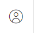

В подразделе Роли и доступы вы можете добавить необходимые для работы с сайтом роли, чтобы в дальнейшем назначить их сотрудникам (Пользователям).

### 

### Добавление новой Роли

Чтобы добавить Роли, нажмите кнопку "Добавить".

.png>)

Задайте *Название* Роли и отметьте те пункты меню, которые будут доступны для данной Роли.

.png>)

### Доступы

Если Пользователю предоставляется доступ:

-  к Магазину (пункты Просмотр заказов, Возможность создать заказ, Возможность принимать заказ, Возможность видеть чужие заказы) 

-  к пункту Работа с тиражами

-  к пункту Работа с отгрузками,

то вы можете установить на каких статусах заказа/сборных тиражей/отгрузок какие права будут у данной Роли: **Не видит, Видит** или **Может править.** 

Редактирование (изменение) возможно только при выборе варианта **Может править.**

.png>)

### **Настройка Уведомлений** 

В самой последней настройке внизу, вы можете настроить уведомления в системе для каждой Роли. 

.png>)

У пользователя с данной ролью будет возможность отредактировать данный пункт у себя в настройках профиля. 

Для этого Пользователь должен нажать на иконку своего профиля {width=61px height=57px} в правом верхнем углу экрана,  перейти в Настройки и бегунками выбрать нужные Уведомления.

.png>)